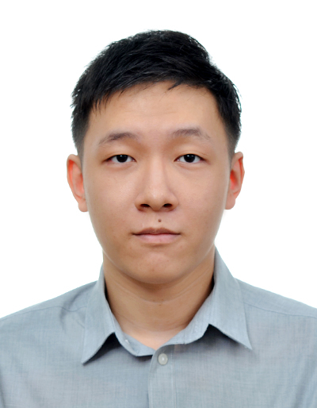
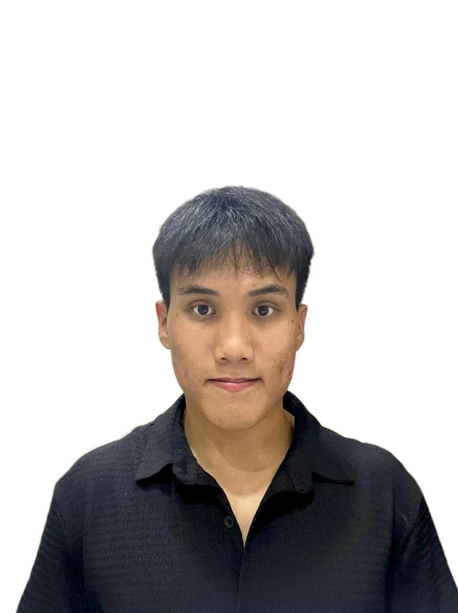
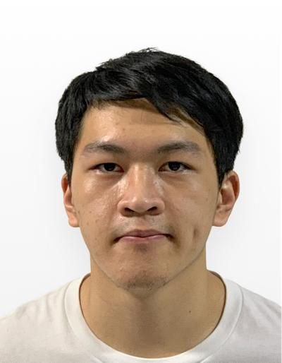
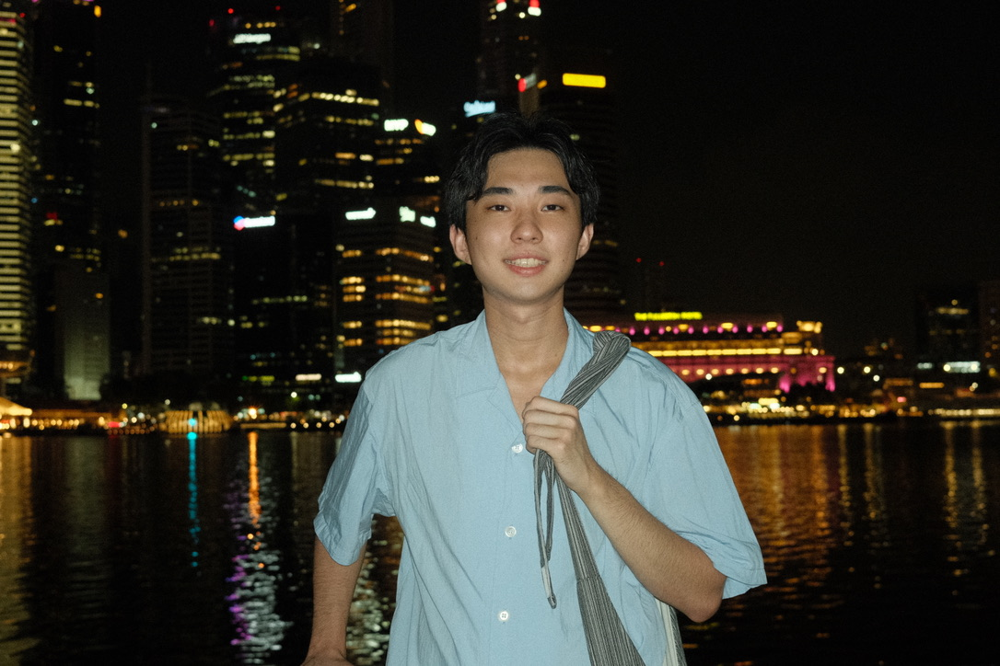
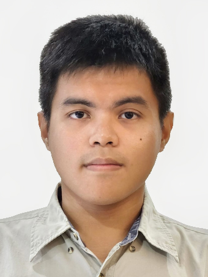

# About Us

We are a team based in the [School of Computing, National University of Singapore](http://www.comp.nus.edu.sg).

You can reach us at the email `chanxiaoyong[at]u.nus.edu`

## Project team

### Yap Zhao Yi

[[github](https://github.com/ToxOptimism)]
[[portfolio](team/zhaoyi.md)]

* Role: Team Lead, Developer
* Responsibilities: Documentation, Code Quality
* In-charge of: Model Component

### Chan Xiao Yong

[[github](https://github.com/caxewhy)]
[[portfolio](team/caxewhy.md)]

* Role: Developer
* Responsibilities: Deliverables and Deadlines, Integration, Scheduling and Tracking, Git Expert
* In-charge of: Storage Component

### Lester Lim Jia Jun

[[github](http://github.com/lesterlimjj)]
[[portfolio](team/lester.md)]

* Role: Developer
* Responsibilities: Documentation, Git Expert, Intellij Expert
* In-charge of: Logic Component

### Low Jian Cheng

[[github](http://github.com/jiancheng37)] [[portfolio](team/jiancheng.md)]

* Role: Developer
* Responsibilities: Test Cases

### Lee Lemuel John Alejo Censon

[[github](http://github.com/ryuse)]
[[portfolio](team/ryuse.md)]

* Role: Developer
* Responsibilities: Integration
* In-charge of: UI Component
