# MatchEstate User Guide

**MatchEstate** is a desktop application tailored for **real estate agents** to efficiently manage their clients — whether they are buyers, sellers, or both. MatchEstate enables fast matching of buyers to suitable listings and vice versa. While it features a graphical interface, the app is optimized for users who prefer fast keyboard-based interactions using a Command Line Interface (CLI).

MatchEstate classifies contacts into two main roles:

**Buyers** are clients looking to purchase a property. They typically have a set of criteria such as budget, location, property type (e.g., HDB, Condo), or features like “near MRT” or “near schools”.
- These are captured in property preferences — each containing a price range and a list of tags representing specific requirements.
- A buyer can have multiple preferences, as they may be looking to purchase more than one property.

**Sellers** are clients looking to list properties for sale.
- Each listing contains essential property details such as postal code, unit number as well as the asking price, and a set of tags to describe its specifications for matching.
- To associate a listing with a seller, agents can simply add the listing to a person, establishing ownership.

#### Automatic Classification:
MatchEstate automatically classifies people based on their data:
- A person is a buyer if they have at least one property preference.
- A person is a seller if they have at least one listing.

💡 A person can be both a buyer and a seller in the system.
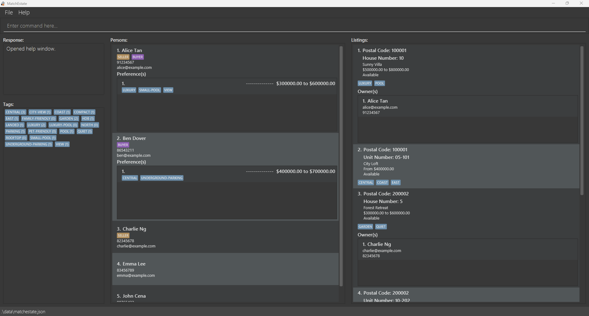

<!-- * Table of Contents -->
<page-nav-print />

--------------------------------------------------------------------------------------------------------------------

## Quick start

1. Ensure you have Java `17` or above installed in your Computer. 
   **Mac users:** Ensure you have the precise JDK version prescribed [here](https://se-education.org/guides/tutorials/javaInstallationMac.html).

1. Download the latest `.jar` file from [here](https://github.com/AY2425S2-CS2103-F08-3/tp/releases/tag/v1.6).

1. Copy the file to the folder you want to use as the _home folder_ for your AddressBook.

1. Open a command terminal, `cd` into the folder you put the jar file in, and use the `java -jar [CS2103-F08-3][MatchEstate].jar` command to run the application. 
   A GUI similar to the below should appear in a few seconds. Note how the app contains some sample data. 
   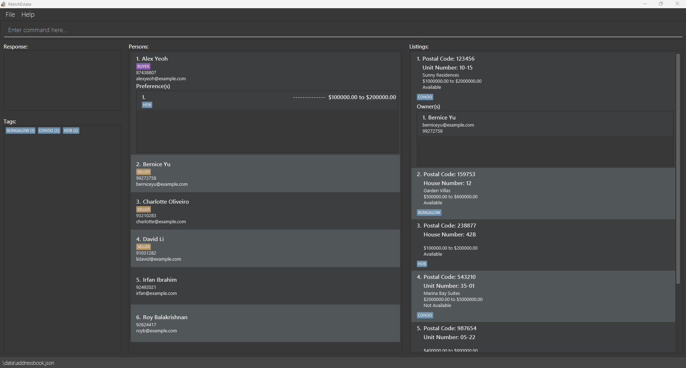

1. Type the command in the command box and press Enter to execute it. e.g. typing **`help`** and pressing Enter will open the help window. 
   Some example commands you can try:

    * `listPerson` : Lists all persons.

    * `listListing` : Lists all listings.

    * `addPerson n/John Doe p/98765432 e/john@example.com` : Adds a person named `John Doe`.

    * `addTag nt/pool nt/near MRT` : Adds the tags `pool` and `near MRT`.

    * `deletePerson 3` : Deletes the 3rd person shown in the current persons list.

    * `deleteListing 1` : Deletes the 1st listing shown in the current listings list.

    * `clear` : Deletes all contacts.

    * `exit` : Exits the app.

1. Refer to the [Features](#features) below for details of each command.

--------------------------------------------------------------------------------------------------------------------

## Features

<box type="info" seamless>

**Notes about the command format:** 

* Words in `UPPER_CASE` are the parameters to be supplied by the user. 
  e.g. in `add n/NAME`, `NAME` is a parameter which can be used as `add n/John Doe`.

* Items in square brackets are optional. 
  e.g `n/NAME [t/TAG]` can be used as `n/John Doe t/friend` or as `n/John Doe`.

* Items in brackets are mutually exclusive. 
  e.g. `pc/POSTAL_CODE (u/UNIT_NUMBER)(h/HOUSE_NUMBER)` can be used as `pc/654321 u/12-111` or as `pc/654321 h/12` but not both.

* Items with `…`​ after them can be used multiple times but at least one time. 
  e.g. `t/TAG…​` can be used as `t/friend`, `t/friend t/family` etc.

* Items in square brackets with `…`​ after them can be used multiple times including zero times. 
  e.g. `[t/TAG]…​` can be used as ` ` (i.e. 0 times), `t/friend`, `t/friend t/family` etc.

* Items in square brackets with a {num} after them, groups 2 or more prefixes in the command which requires at least 1 prefix from the group to be present. 
  e.g. `[t/TAG]{1}... [nt/NEW_TAG]{1}...` can be used as `nt/friend`, `t/family`, `t/family nt/friend` but not ` `(no parameter specified).

* Parameters can be in any order. 
  e.g. if the command specifies `n/NAME p/PHONE_NUMBER`, `p/PHONE_NUMBER n/NAME` is also acceptable.

* Extraneous parameters for commands that do not take in parameters (such as `help`, `list`, `exit` and `clear`) will be ignored. 
  e.g. if the command specifies `help 123`, it will be interpreted as `help`.

* If you are using a PDF version of this document, be careful when copying and pasting commands that span multiple lines as space characters surrounding line-breaks may be omitted when copied over to the application.

</box>

### Command Summary

#### General Commands
| Command   | Description                                             | Usage |
|-----------|---------------------------------------------------------|-------|
**Help** | Displays all command usage on a second window |`help`
**Clear** | Clears all entries from the MatchEstate                 |`clear`
**Exit** | Exits the program                                       |`exit`

#### Person Management

| Command   | Description                                                       | Usage |
|-----------|-------------------------------------------------------------------|-------|
**Add Person** | Adds a person to MatchEstate.                                    |`addPerson n/NAME p/PHONE e/EMAIL`
**List Persons** | Shows a list of all persons in MatchEstate                   |`listPerson`
**Edit Person** | Edits an existing person in MatchEstate                      |`editPerson PERSON_INDEX [n/NAME]{1} [p/PHONE]{1} [e/EMAIL]{1}`
**Search Person by Name** | Finds persons whose names match the given keyword(s)             |`searchPersonName KEYWORD [MORE_KEYWORDS]`
**Search Person by Tags** | Finds persons with property preferences containing all specified tag(s) |`searchPersonTag t/TAG...`
**Delete Person**  | Deletes the specified person from MatchEstate                |`deletePerson PERSON_INDEX`

#### Listing Management

| Command   | Description                                     | Usage |
|-----------|-------------------------------------------------|-------|
**Add Listing** | Adds a listing to MatchEstate.             |`addListing pc/POSTAL_CODE (u/UNIT_NUMBER)(h/HOUSE_NUMBER) [lbp/LOWER_BOUND_PRICE] [ubp/UPPER_BOUND_PRICE] [n/PROPERTY_NAME] [t/TAG]... [nt/NEW_TAG]...`
**List Listings** | Shows a list of all property listings          |`listListing`
**Search Listings by Tags** | Finds listings with all specified tags         |`searchListingTag t/TAG...`
**Search Owner’s Listings**  | Finds listings owned by a specific person      |`searchOwnerListing PERSON_INDEX`
**Mark Available**| Marks Listing as available                     |`markAvailable LISTING_INDEX`
**Mark Unavailable** | Marks listing as unavailable                   |`markUnavailable LISTING_INDEX`
**Delete Listing** | Deletes the specified listing from MatchEstate |`deleteListing LISTING_INDEX`

#### Tag Management

| Command   | Description                                   | Usage |
|-----------|-----------------------------------------------|-------|
**Add Tags** | Adds new tags to the system            |`addTag nt/NEW_TAG...`
**Delete Tags** | Deletes the specified tags from the system       |`deleteTag t/TAG...`

#### Preference Management

| Command   | Description                                   | Usage |
|-----------|-----------------------------------------------|-------|
**Add Preference**  | Adds a property preference to a person          |`addPreference PERSON_INDEX [lbp/LOWER_BOUND_PRICE] [ubp/UPPER_BOUND_PRICE] [t/TAG]... [nt/NEW_TAG]...`
**Add Preference Tags**  | Adds tags to an existing preference          |`addPreferenceTag PERSON_INDEX PREFERENCE_INDEX [t/TAG]{1}... [nt/NEW_TAG]{1}...`
**Overwrite Preference Tags** | Replaces all tags in an existing preference     |`overwritePreferenceTag PERSON_INDEX PREFERENCE_INDEX [t/TAG]{1}... [nt/NEW_TAG]{1}...`
**Delete Preference**  | Deletes a person's property preference        |`deletePreference PERSON_INDEX PREFERENCE_INDEX`
**Delete Preference Tags** | Deletes tags from a person's preference       |`deletePreferenceTag PERSON_INDEX PREFERENCE_INDEX t/TAG...`

#### Listing Tag Management
| Command   | Description                     | Usage |
|-----------|---------------------------------|-------|
**Add Listing Tags**  | Adds tags to a listing         |`addListingTag LISTING_INDEX [t/TAG]{1}... [nt/NEW_TAG]{1}...`
**Overwrite Listing Tags**  | Replaces all tags in a listing |`overwriteListingTag LISTING_INDEX [t/TAG]{1}... [nt/NEW_TAG]{1}...`
**Delete Listing Tags** | Deletes tags from a listing    |`deleteListingTag LISTING_INDEX t/TAG...`

#### Matching System
| Command   | Description                     | Usage |
|-----------|---------------------------------|-------|
**Match Person's Preference to Listings**  | Finds listings matching a person's preference        |`matchPreference PERSON_INDEX PREFERENCE_INDEX`
**Match Listing to Persons**   | Finds persons whose preferences match a listing |`matchListing LISTING_INDEX`

#### Listing Owner Management
| Command   | Description                          | Usage |
|-----------|--------------------------------------|-------|
**Add Owner**  | Adds a person as owner to a listing |`addOwner PERSON_INDEX LISTING_INDEX`
**Delete Owner**   | Removes an owner from a listing     |`deleteOwner LISTING_INDEX OWNER_INDEX`

### General Commands

#### Viewing help : `help`

Opens a second window displaying all the command usages and explaining how to access the user guide.

Format: `help`

Result for `help`:

#### Clearing all data: `clear`
Clears all entries from the address book.

Format: `clear`

Result for `clear`:
* Before
 

* After
 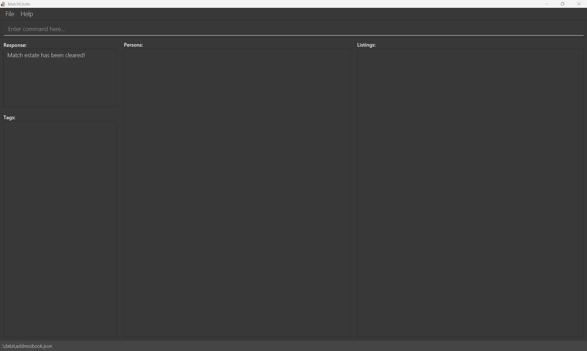

#### Exiting the program: `exit`
Exits the program.

Format: `exit`

### Saving the data

MatchEstate data is saved in the hard disk automatically after any command that changes the data. There is no need to save manually.

### Editing the data file

MatchEstate data is saved automatically as a JSON file `[JAR file location]/data/matchestate.json`. Advanced users are welcome to update data directly by editing that data file.

<box type="warning" seamless>

**Caution:**
If your changes to the data file makes its format invalid, MatchEstate will save a copy of the invalid file and start with an empty data file at the next run.  However, it is recommended to make a backup of the file before editing it. 
Furthermore, certain edits can cause the MatchEstate to behave in unexpected ways (e.g., if a value entered is outside the acceptable range). Therefore, edit the data file only if you are confident that you can update it correctly.

</box>

### Person Management

#### Adding a person: `addPerson`
Adds a person to MatchEstate .

Format: `addPerson n/NAME p/PHONE e/EMAIL`

Input restriction:
* `NAME` must start with a letter. 
* `NAME` must only contain 2-60 characters that allow spaces, hyphens, full stops, or apostrophes.
* `PHONE` must be between 3-15 digits. The digits can be prefixed with a `+` sign. 
* `PHONE` must also be unique since it is used to unique identify a person.
* `EMAIL` must be in a format with local-part and domain name, like `name@domain` or `name@domain.com`.
    * local-part must only contain alphanumeric characters and these special characters, `+_.-`.
    * local-part must not start or end with any special characters.
    * domain name contains domain labels separated by `.` or `-`.
    * each domain name must end with a domain label of 2 characters long
    * each domain label must contain alphanumeric characters

<box type="info" seamless>

Note on uniquely identifying Person:

- `Phone` is used to uniquely identify a person, since phone numbers are a commonly used as a direct and personal means of contact. 

- In contrast, `Email` is primarily used to send any legal documents regarding the transaction and thus may often use a shared organizational email. As such, duplicate phone numbers are disallowed to prevent ambiguity, while duplicate emails are permitted.

- `Name` represents the client's name for a real estate agent to address by, and does not need to be a full legal name. Additionally since multiple people may share the same name, duplicates are allowed.

</box>

Examples:
* `addPerson n/Betty Smith p/+6598274892 e/bettysmith@abc`
* `addPerson n/Bob Parker p/934 e/bobparker@bom-com`
* `addPerson n/John Doe p/98765432 e/johnd@example.com`

Result for `addPerson n/John Doe p/98765432 e/johnd@example.com`:
* Before
 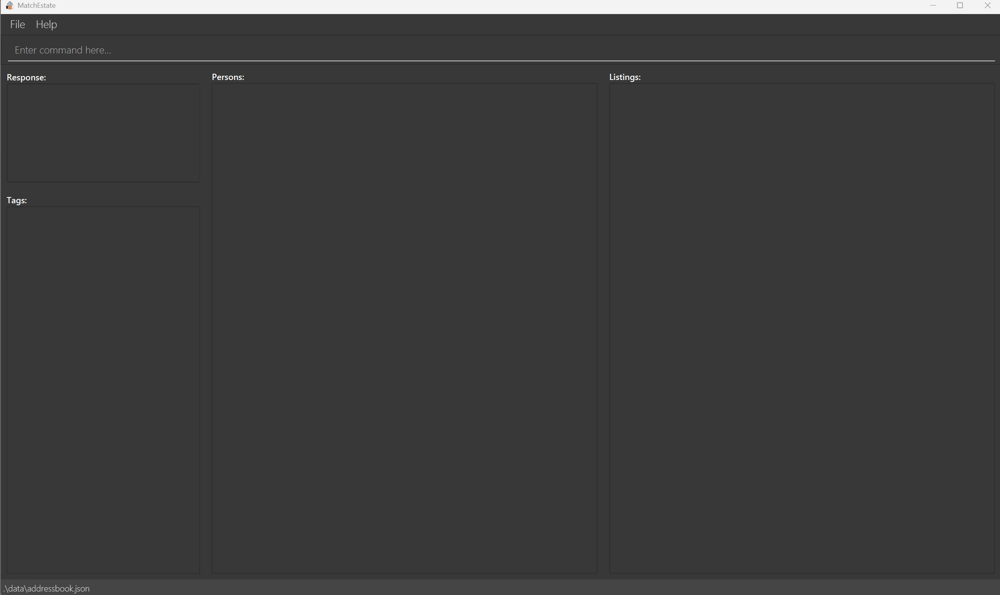

* After
 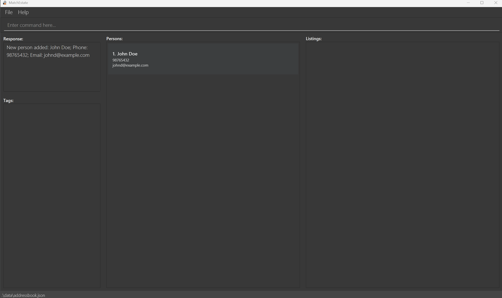

#### Listing all persons: `listPerson`
Shows a list of all persons in the MatchEstate .

Format: `listPerson`

Result for `listPerson`:
* Before
 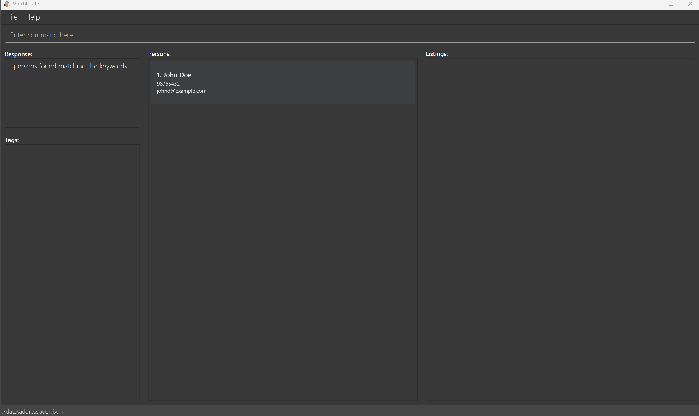

* After
 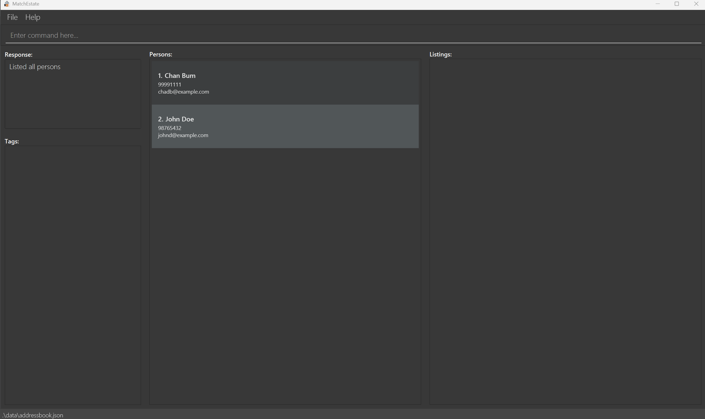

#### Editing a person: `editPerson`
Edits an existing person in the MatchEstate.

Format: `editPerson PERSON_INDEX [n/NAME]{1} [p/PHONE]{1} [e/EMAIL]{1}`

Input restriction:
* `PERSON_INDEX` must be a positive integer within the bounds of the person list.
* `NAME` must start with a letter.
* `NAME` must only contain 2-60 characters that allow spaces, hyphens, full stops, or apostrophes.
* `PHONE` must be between 3-15 digits. The digits can be prefixed with a `+` sign.
* `PHONE` must also be unique since it is used to unique identify a person.
* `EMAIL` must be in a format with local-part and domain name, like `name@domain` or `name@domain.com`.
    * local-part must only contain alphanumeric characters and these special characters, `+_.-`.
    * local-part must not start or end with any special characters.
    * domain name contains domain labels separated by `.` or `-`.
    * each domain name must end with a domain label of 2 characters long
    * each domain label must contain alphanumeric characters

<box type="info" seamless>

Note on uniquely identifying Person:

- `Phone` is used to uniquely identify a person, since phone numbers are a commonly used as a direct and personal means of contact.

- In contrast, `Email` is primarily used to send any legal documents regarding the transaction and thus may often use a shared organizational email. As such, duplicate phone numbers are disallowed to prevent ambiguity, while duplicate emails are permitted.

- `Name` represents the client's name for a real estate agent to address by, and does not need to be a full legal name. Additionally since multiple people may share the same name, duplicates are allowed.

</box>

Examples:
* `editPerson 1 n/Betty Smith` Edits the name of the 1st person.
* `editPerson 2 p/91234567 e/johndoe@example.com` edits the phone number and email address of the 2nd person.
* `editPerson 3 n/Bob Parker p/+6581008383 e/bobparker@example.com` Edits the name, phone number and email address of the 3rd person.

Result for `editPerson 2 p/91234567 e/johndoe@example.com`:
* Before
 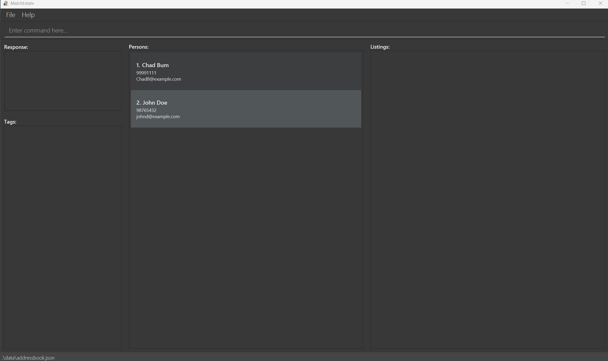

* After
 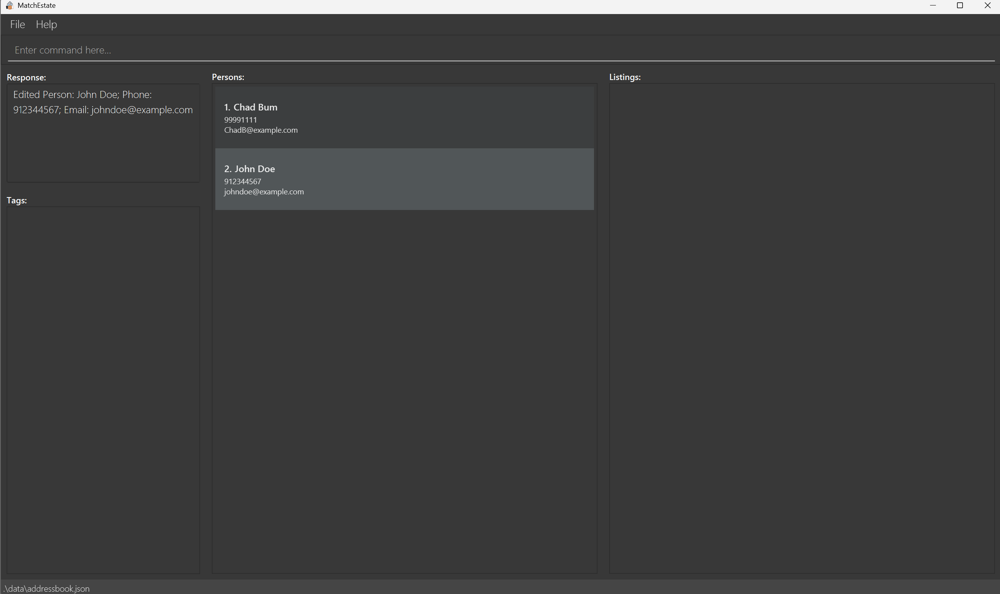

#### Searching persons by name: `searchPersonName`
Finds persons whose names match any of the given keyword(s). 

Format: `searchPersonName KEYWORD [MORE_KEYWORDS]`

Input restriction:
* The search is case-insensitive.
* `KEYWORD` and `MORE_KEYWORDS` must contain only letters, hyphens, full stops, or apostrophes.
* Every `KEYWORD` and `MORE_KEYWORDS` can only start with a letter.

> ⚠️ **Note:** Any command will override the results of the filter. However, the commands will act on the currently displayed index.

Examples:
* `searchPersonName John` returns persons with names matching "John".
* `searchPersonName John Doe` returns persons with names matching "John" or "Doe".
* `searchPersonName John Doe Bob` returns persons with names matching "John", "Doe" or "Bob".

Result for `searchPersonName John Doe`:
* Before
 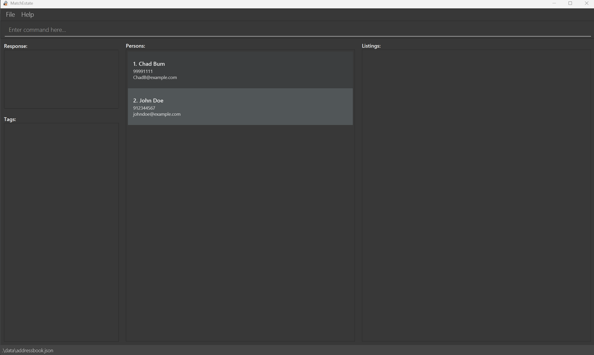

* After
 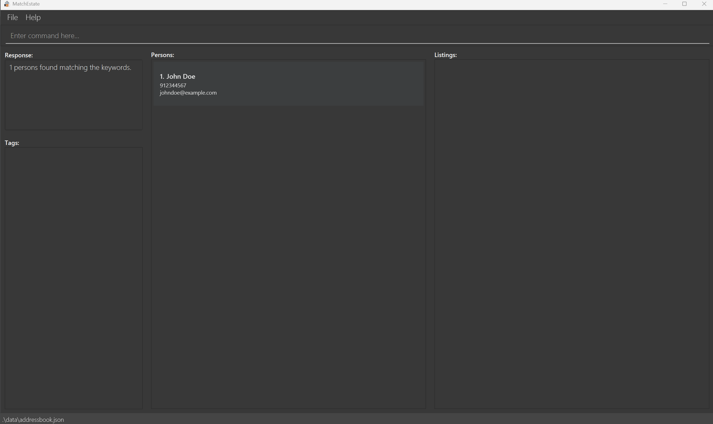

#### Searching persons by tags: `searchPersonTag`
Finds persons with property preferences containing all specified tags.

Format: `searchPersonTag t/TAG...`

Input restriction:
* The search is case-insensitive.
* `TAG` must be between 2 and 30 characters long and can only contain letters, numbers, apostrophes, spaces, periods, hyphens, underscores, plus, and ampersands. 
* The tag cannot be blank and must already exist.

> ⚠️ **Note:** Any command will override the results of the filter. However, the commands will act on the currently displayed index.

Example:
* `searchPersonTag t/gym` returns all persons who have at least one property preference containing the `gym` tag
* `searchPersonTag t/gym t/pet-friendly` returns all persons who have at least one property preference containing both `gym` and `pet-friendly` tags.

Result for `searchPersonTag t/gym t/pet-friendly`:
* Before
 

* After
 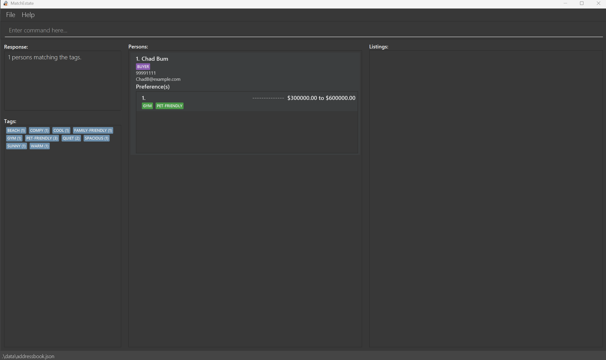

#### Deleting a person: `deletePerson`
Deletes the specified person from MatchEstate, along with their property preferences and ownerships of listing.

Format: `deletePerson PERSON_INDEX`

Input restriction:
* `PERSON_INDEX` must be a positive integer within the bounds of the person list.

Examples:
* `deletePerson 2` deletes the 2nd person in MatchEstate.

Result for `deletePerson 2`:
* Before
 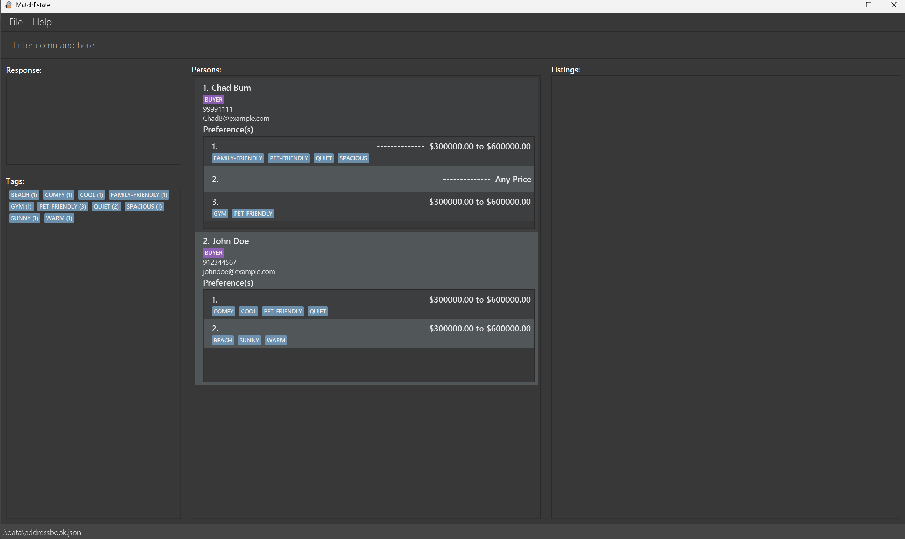

* After
 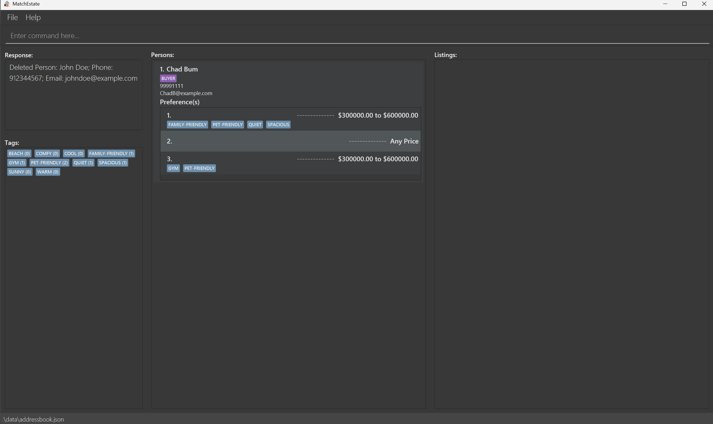

### Listing Management

#### Adding a listing: `addListing`
Adds a property listing to MatchEstate.

Format: `addListing pc/POSTAL_CODE (u/UNIT_NUMBER)(h/HOUSE_NUMBER)
[lbp/LOWER_BOUND_PRICE] [ubp/UPPER_BOUND_PRICE] [n/PROPERTY_NAME] [t/TAG]... [nt/NEW_TAG]...`

Input restriction:
* `POSTAL_CODE` must be exactly 6 digits, where each digit must be between 0 and 9.
* `UNIT_NUMBER` must be in the format of <optional B/R prefix><floor_number>-<apartment_number><optional_subunit> where the optional B/R represents basement or roof, the floor_number is 2 digits, the apartment number must be 2 to 5 digits, and subunit must be a capital letter.
* This subunit letter cannot be I or O.
* `HOUSE_NUMBER` must be at most 3 characters long, consisting of only letters and numbers. The last character cannot be 'I' or 'O'.
* A house number must not be specified with a unit number.
* `LOWER_BOUND_PRICE` and `UPPER_BOUND_PRICE` must be a non-negative number with up to 2 decimal places. If no value is given for a price, the price will be unbounded.
* `PROPERTY_NAME` must be between 2 and 100 characters long and can only contain letters, numbers, apostrophes, periods, hyphens, and spaces.
* `TAG` and `NEW_TAG` must be between 2 and 30 characters long and can only contain letters, numbers, apostrophes, spaces, periods, hyphens, underscores, plus, and ampersands.
* `TAG` tag cannot be blank and must already exist.
* `NEW_TAG` tag cannot be blank and must not already exist.

Example:
* `addListing pc/654321 u/10-12`
* `addListing pc/654321 h/12 lbp/300000 ubp/600000 n/Sunny Villa t/quiet t/pet-friendly nt/family-friendly nt/spacious`
* `addListing pc/654321 u/10-12 lbp/30000 nt/spacious`
* `addListing pc/777321 u/R10-12345C lbp/300000 ubp/600000 n/Quiet Vale nt/quiet`

Result for `addListing pc/654321 h/12 lbp/300000 ubp/600000 n/Sunny Villa t/quiet t/pet-friendly nt/family-friendly nt/spacious`:
* Before
 

* After
 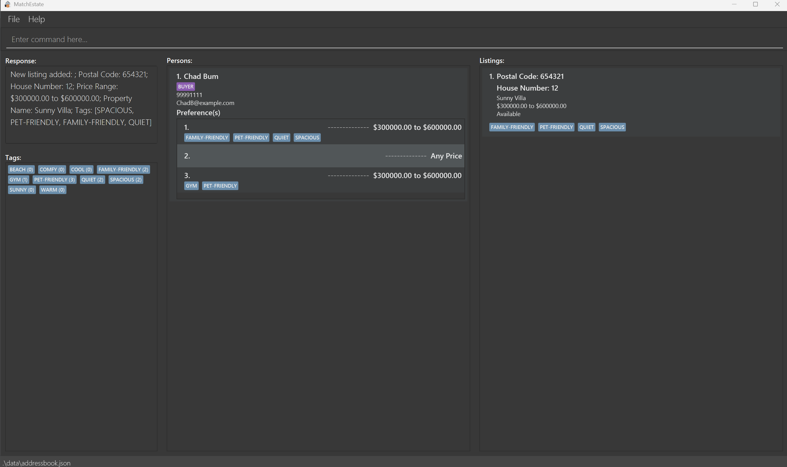

#### Listing all properties: `listListing`
Shows a list of all property listings.

Format: `listListing`

Result for `listListing`:
* Before
 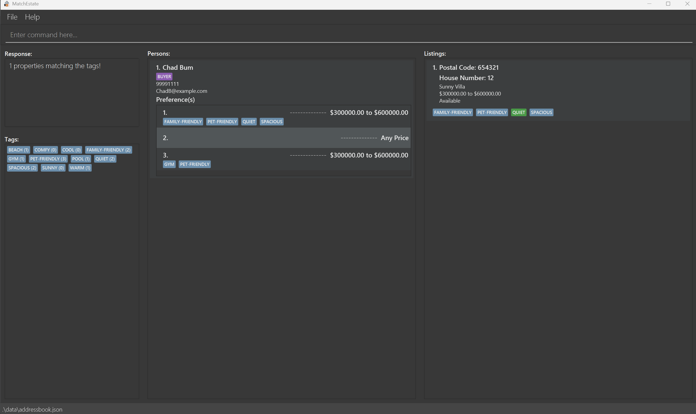

* After
 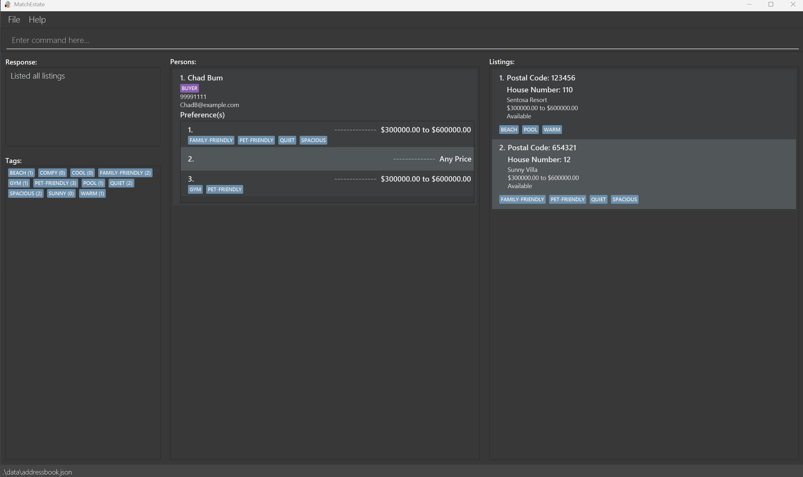

#### Searching listings by tags: `searchListingTag`
Finds properties with all specified tags.

Format: `searchListingTag t/TAG...`

Input restriction:
* The search is case-insensitive.
* `TAG` must be between 2 and 30 characters long and can only contain letters, numbers, apostrophes, spaces, periods, hyphens, underscores, plus, and ampersands. 
* The tag cannot be blank and must already exist.

> ⚠️ **Note:** Any command will override the results of the filter. However, the commands will act on the currently displayed index.

Example:
* `searchListingTag t/pet-friendly` 
* `searchListingTag t/pet-friendly t/pool` returns all listings **that contain ALL the specified tags (`pet-friendly` and `pool`)**.

Result for `searchListingTag t/pet-friendly t/pool`:
* Before
 

* After
 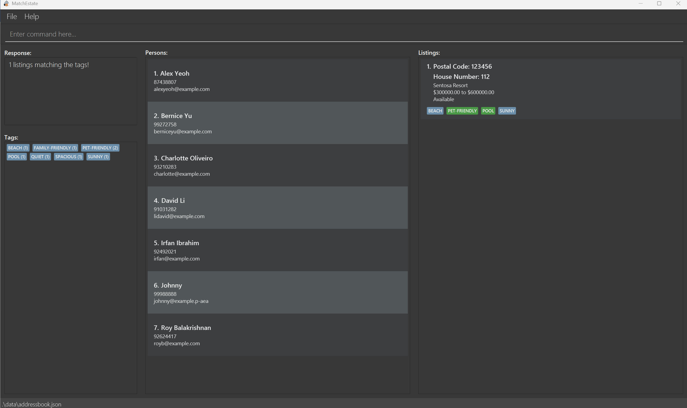

#### Searching owner’s listings: `searchOwnerListing`
Finds properties owned by a specific person.

Format: `searchOwnerListing PERSON_INDEX`

Input restriction:
* The search is case-insensitive.
* `PERSON_INDEX` must be a positive integer within the bounds of person list.

> ⚠️ **Note:** Any command will override the results of the filter. However, the commands will act on the currently displayed index.

Example:
* `searchOwnerListing 2`

Result for `searchOwnerListing 2`:
* Before
 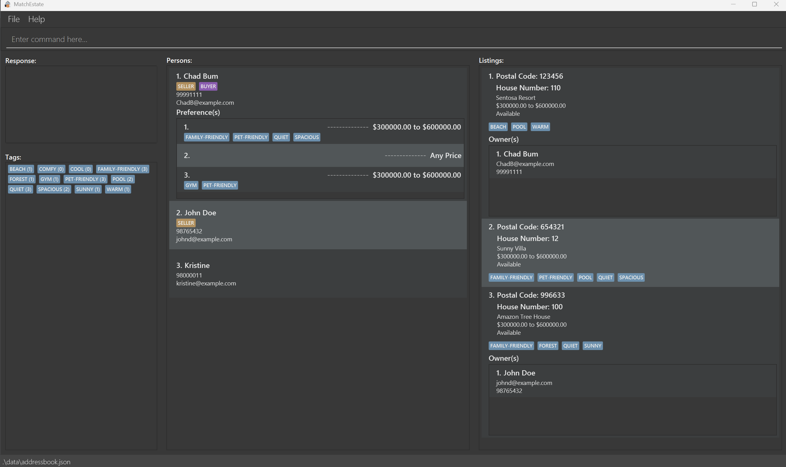

* After
 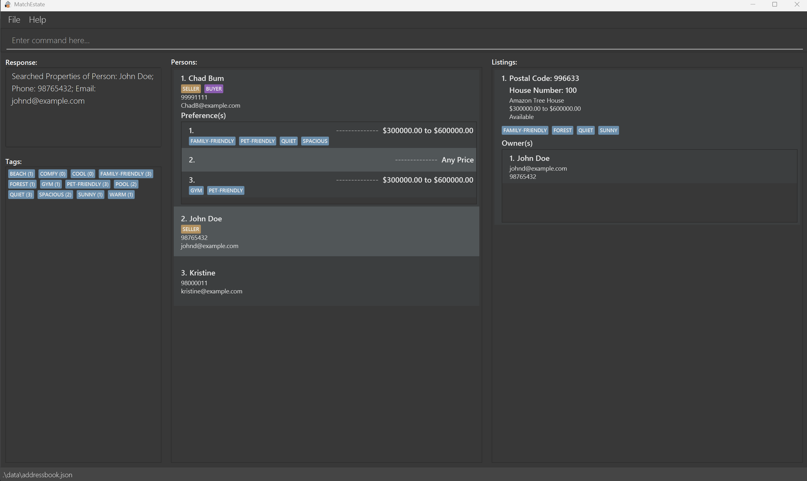

#### Marking listing availability: `markAvailable`
- `markAvailable`: Marks listing as available

Format: `markAvailable LISTING_INDEX`

Input restriction:
* `LISTING_INDEX` must be a positive integer within the bounds of listing list.

Example:
* `markAvailable 1`

Result for `markAvailable 1`:
* Before
   

* After
   

#### Marking listing unavailability: `markUnavailable`
- `markUnavailable`: Marks listing as unavailable
- Listings marked as unavailable will not be matched to any person.

Format: `markUnavailable LISTING_INDEX`

Input restriction:
* `LISTING_INDEX` must be a positive integer within the bounds of listing list.

Example:
* `markUnavailable 2`

Result for `markUnavailable 2`:
* Before
 

* After
 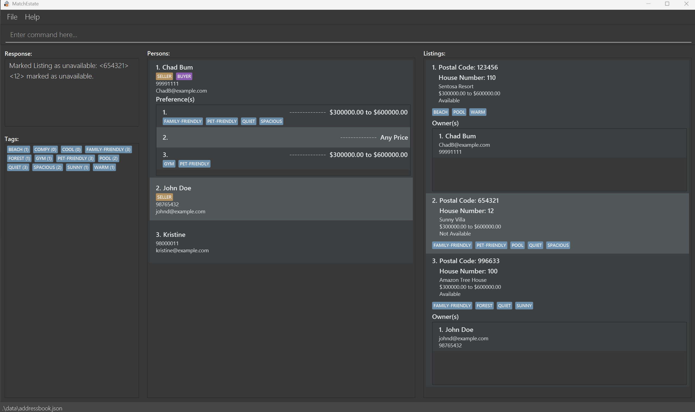

#### Deleting a listing: `deleteListing`
Deletes the specified listing from MatchEstate.

Format: `deleteListing LISTING_INDEX`

Input restriction:
* `LISTING_INDEX` must be a positive integer within the bounds of listing list.

Example:
* `deleteListing 1`

Result for `deleteListing 1`:
* Before
 

* After
 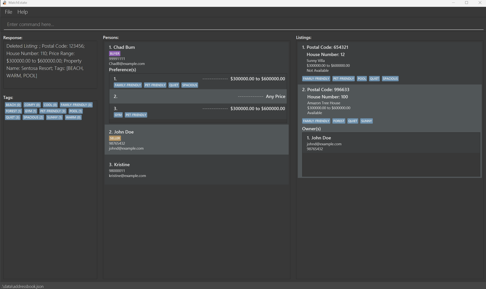

### Tag Management

#### Adding tags: `addTag`
Adds new tags to the system.

Format: `addTag nt/NEW_TAG...`

Input restriction:
* `NEW_TAG` must be between 2 and 30 characters long and can only contain letters, numbers, apostrophes, spaces, periods, hyphens, underscores, plus, and ampersands.
* `NEW_TAG` tag cannot be blank and must not already exist.

Example:
* `addTag nt/family-friendly`
* `addTag nt/elderly-friendly nt/vintage`

Result for `addTag nt/elderly-friendly nt/vintage`:
* Before
 

* After
 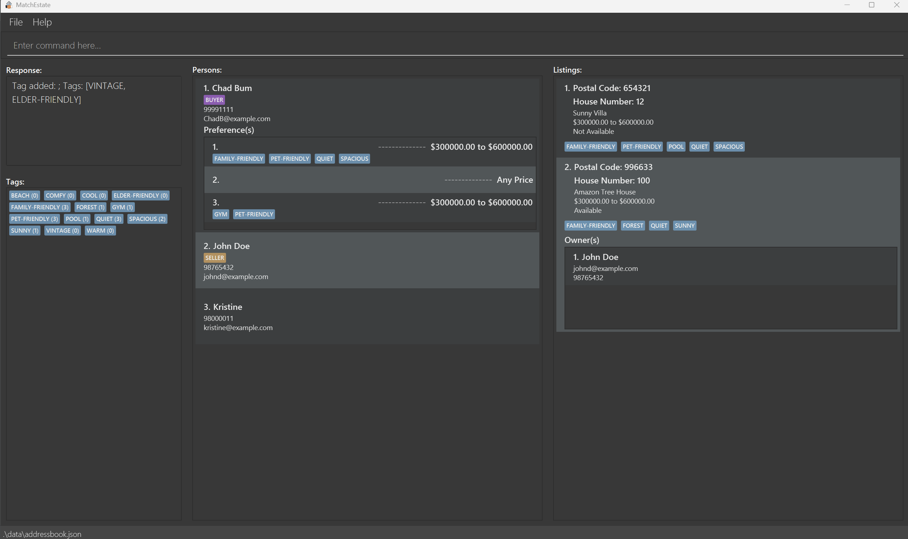

#### Deleting tags: `deleteTag`
Deletes the specified tags from the system.

Format: `deleteTag t/TAG...`

Input restriction:
* `TAG` must be between 2 and 30 characters long and can only contain letters, numbers, apostrophes, spaces, periods, hyphens, underscores, plus, and ampersands. 
* The tag cannot be blank and must already exist.

Example:
* `deleteTag t/quiet`
* `deleteTag t/quiet t/pet-friendly`

Result for `deleteTag t/quiet t/pet-friendly`:
* Before
 

* After
 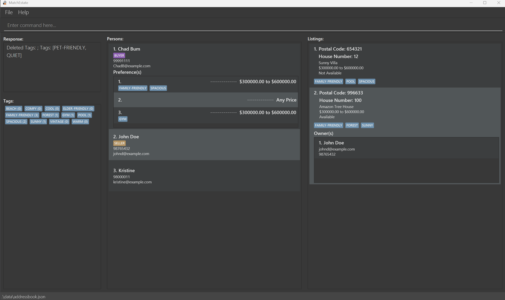

### Preference Management

#### Adding a preference: `addPreference`
Adds a property preference to a person.

Format: `addPreference PERSON_INDEX [lbp/LOWER_BOUND_PRICE] [ubp/UPPER_BOUND_PRICE] [t/TAG]... [nt/NEW_TAG]...`

Input restriction:
* `PERSON_INDEX ` must be a positive integer within the bounds of person list.
* `LOWER_BOUND_PRICE` and `UPPER_BOUND_PRICE` must be a non-negative number with up to 2 decimal places. If no value is given for a price, the price will be unbounded.
* `TAG` and `NEW_TAG` must be between 2 and 30 characters long and can only contain letters, numbers, apostrophes, spaces, periods, hyphens, underscores, plus, and ampersands.
* `TAG` tag cannot be blank and must already exist.
* `NEW_TAG` tag cannot be blank and must not already exist.

Example:
* `addPreference 1`
* `addPreference 2 lbp/300000 ubp/600000 t/quiet t/pet-friendly nt/family-friendly nt/spacious`
* `addPreference 1 ubp/600000`

Result for `addPreference 2 lbp/300000 ubp/600000 t/quiet t/pet-friendly nt/family-friendly nt/spacious`:
* Before
 

* After
 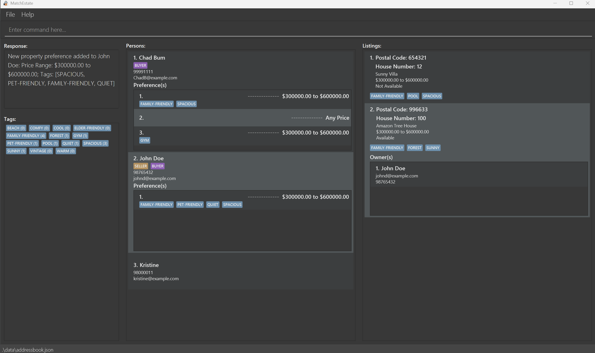

#### Adding tags to a preference: `addPreferenceTag`
Adds tags to an existing preference.

Format: `addPreferenceTag PERSON_INDEX PREFERENCE_INDEX [t/TAG]{1}... [nt/NEW_TAG]{1}...`

Input restriction:
* `PERSON_INDEX` and `PREFERENCE_INDEX` must be a positive integer within the bounds of the person list and that person's preference list respectively.
* `TAG` and `NEW_TAG` must be between 2 and 30 characters long and can only contain letters, numbers, apostrophes, spaces, periods, hyphens, underscores, plus, and ampersands.
* `TAG` tag cannot be blank and must already exist.
* `NEW_TAG` tag cannot be blank and must not already exist.

Example:
* `addPreferenceTag 1 1 t/quiet`
* `addPreferenceTag 1 1 nt/cool`
* `addPreferenceTag 1 1 t/quiet t/pet-friendly t/cool`

Result for `addPreferenceTag 1 1 t/quiet t/pet-friendly t/cool`:
* Before
 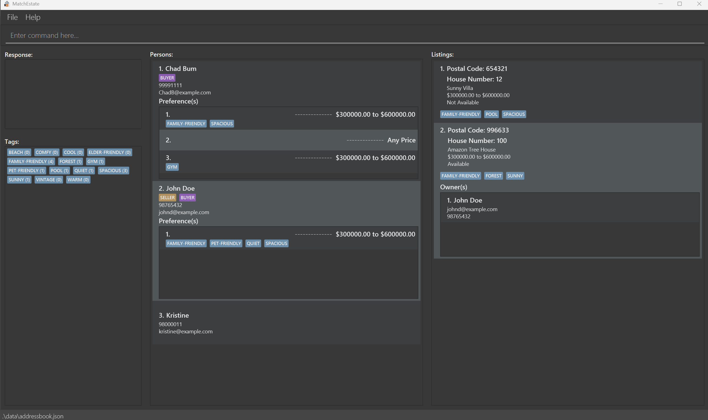

* After
 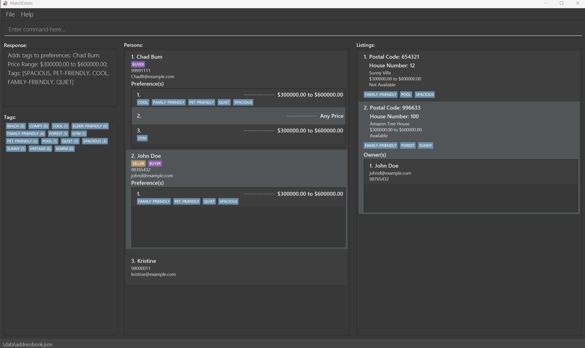

#### Overwriting preference tags: `overwritePreferenceTag`
Replaces all tags in an existing preference.

Format: `overwritePreferenceTag PERSON_INDEX PREFERENCE_INDEX [t/TAG]{1}... [nt/NEW_TAG]{1}...`

Input restriction:
* `PERSON_INDEX` and `PREFERENCE_INDEX` must be a positive integer within the bounds of the person list and that person's preference list respectively.
* `TAG` and `NEW_TAG` must be between 2 and 30 characters long and can only contain letters, numbers, apostrophes, spaces, periods, hyphens, underscores, plus, and ampersands.
* `TAG` tag cannot be blank and must already exist.
* `NEW_TAG` tag cannot be blank and must not already exist.

Example:
* `overwritePreferenceTag 3 2 t/2bed-rooms`
* `overwritePreferenceTag 3 2 nt/seaside-view`
* `overwritePreferenceTag 2 1 nt/2bed-rooms nt/seaside-view`

Result for `overwritePreferenceTag 2 1 nt/2bed-rooms nt/seaside-view`:
* Before
 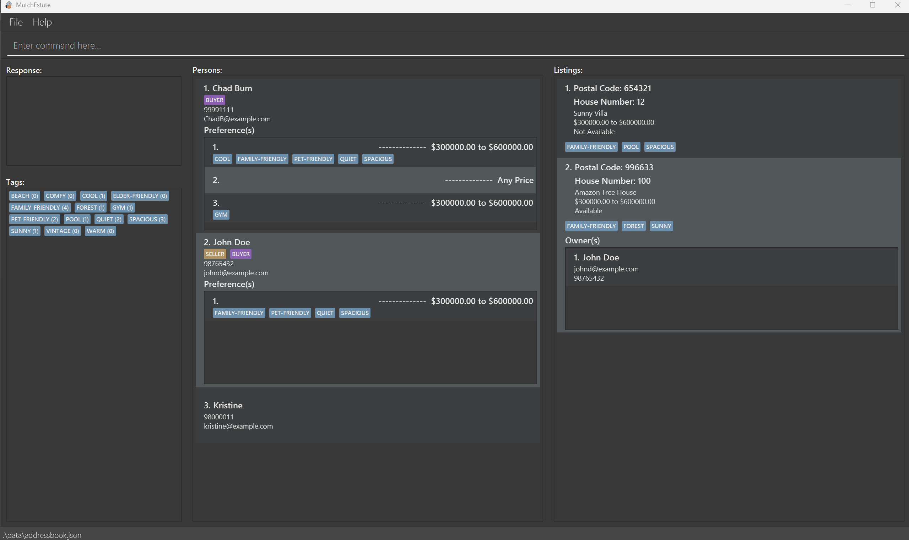

* After
 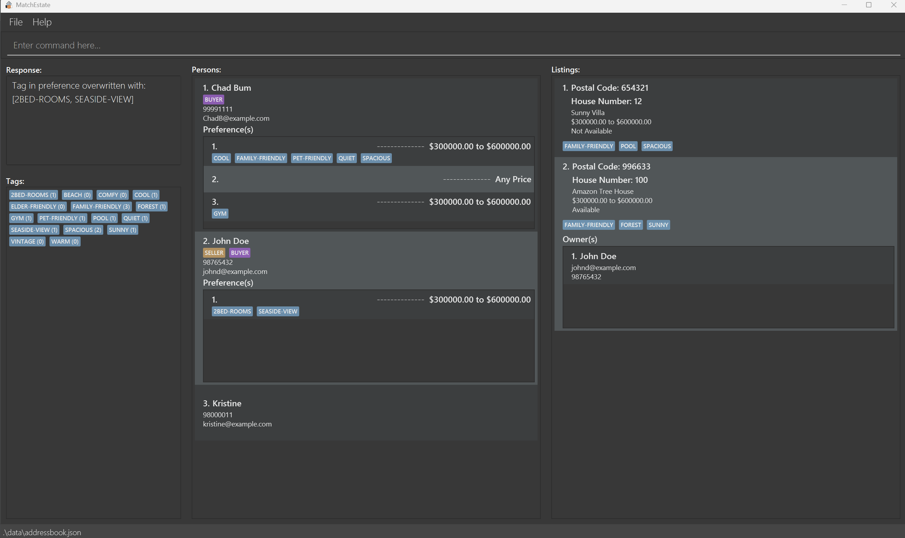

#### Deleting a preference: `deletePreference`
Deletes a person's property preference.

Format: `deletePreference PERSON_INDEX PREFERENCE_INDEX`

Input restriction:
* `PERSON_INDEX` and `PREFERENCE_INDEX` must be a positive integer within the bounds of the person list and that person's preference list respectively.

Example:
* `deletePreference 2 1`

Result for `deletePreference 2 1`:
* Before
 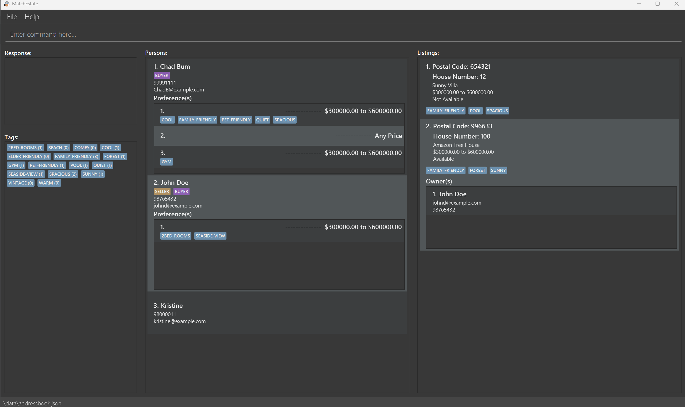

* After
 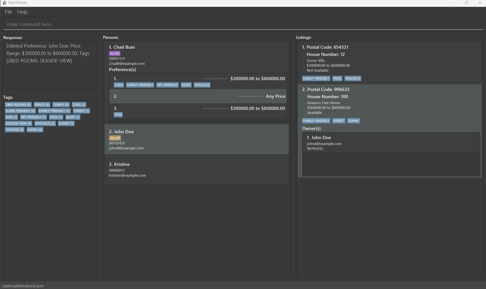

#### Deleting preference tags: `deletePreferenceTag`
Deletes tags from a person's preference.

Format: `deletePreferenceTag PERSON_INDEX PREFERENCE_INDEX t/TAG...`

Input restriction:
* `PERSON_INDEX` and `PREFERENCE_INDEX` must be a positive integer within the bounds of the person list and that person's preference list respectively.
* `TAG` must be between 2 and 30 characters long and can only contain letters, numbers, apostrophes, spaces, periods, hyphens, underscores, plus, and ampersands. 
* The tag cannot be blank and must already exist.

Example:
* `deletePreferenceTag 3 1 t/pet-friendly`
* `deletePreferenceTag 3 1 t/quiet t/cool`

Result for `deletePreferenceTag 3 1 t/quiet t/cool`:
* Before
 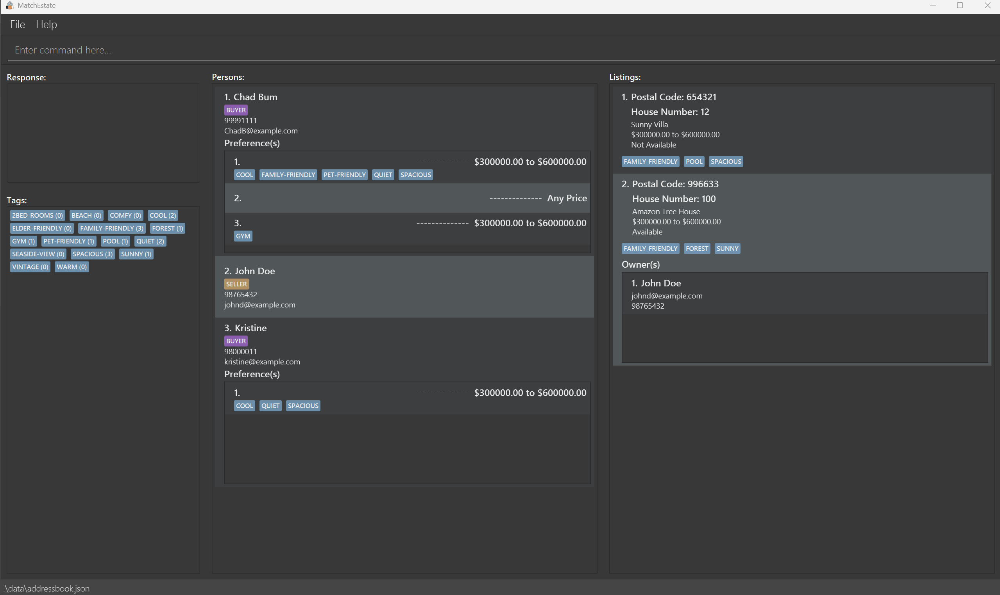

* After
 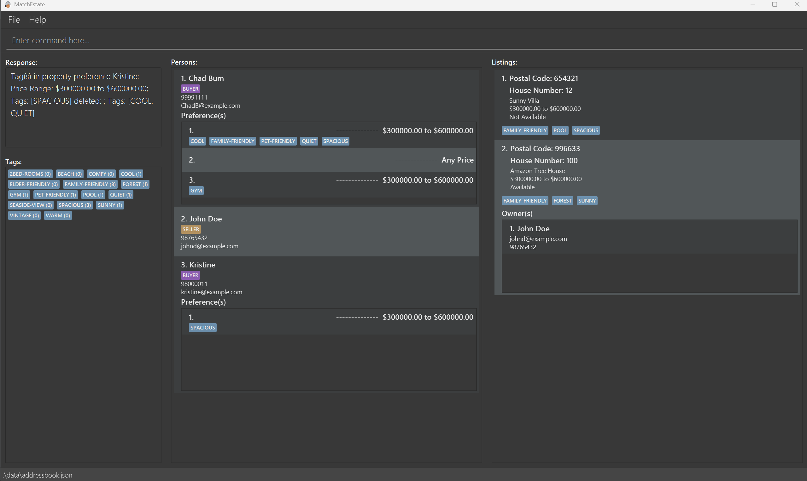

### Listings’ Tag Management

#### Adding tags to listing: `addListingTag`
Adds tags to a property listing.

Format: `addListingTag LISTING_INDEX [t/TAG]{1}... [nt/NEW_TAG]{1}...`

Input restriction:
* `LISTING_INDEX` must be a positive integer within the bounds of the listings list.
* `TAG` and `NEW_TAG` must be between 2 and 30 characters long and can only contain letters, numbers, apostrophes, spaces, periods, hyphens, underscores, plus, and ampersands.
* `TAG` tag cannot be blank and must already exist.
* `NEW_TAG` tag cannot be blank and must not already exist.

Example:
* `addListingTag 2 t/quiet`
* `addListingTag 2 t/quiet t/pet-friendly nt/spacious`

Result for `addListingTag 2 t/quiet t/pet-friendly nt/spacious`:
* Before
 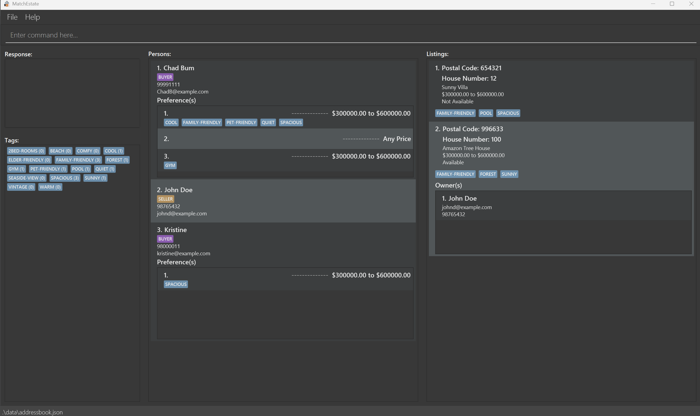

* After
 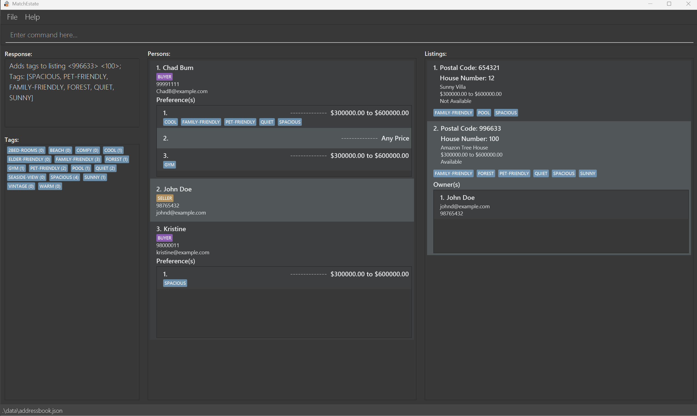

#### Overwriting Listing Tags: `overwriteListingTag`
Replaces all tags in a listing.

Format: `overwriteListingTag LISTING_INDEX [t/TAG]{1}... [nt/NEW_TAG]{1}...`

Input restriction:
* `LISTING_INDEX` must be a positive integer within the bounds of the listings list.
* `TAG` and `NEW_TAG` must be between 2 and 30 characters long and can only contain letters, numbers, apostrophes, spaces, periods, hyphens, underscores, plus, and ampersands.
* `TAG` tag cannot be blank and must already exist.
* `NEW_TAG` tag cannot be blank and must not already exist.

Example:
* `overwriteListingTag 3 t/4-bedrooms`
* `overwriteListingTag 3 nt/seaside-view`
* `overwriteListingTag 2 nt/4-bedrooms nt/2-toilets nt/seaside-view`

Result for `overwriteListingTag 2 nt/4-bedrooms nt/2-toilets nt/seaside-view`:
* Before
 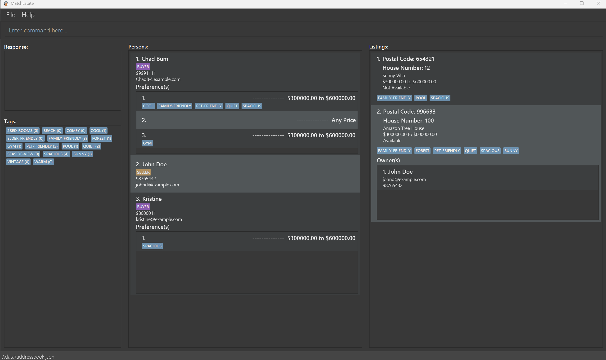

* After
 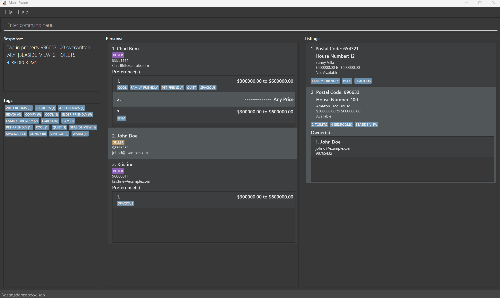

#### Delete Listing Tags: `deleteListingTag`
Deletes tags from a listing.

Format: `deleteListingTag LISTING_INDEX t/TAG...`

Input restriction:
* `LISTING_INDEX ` must be a positive integer within the bounds of the listings list.
* `TAG` must be between 2 and 30 characters long and can only contain letters, numbers, apostrophes, spaces, periods, hyphens, underscores, plus, and ampersands. 
* The tag cannot be blank and must already exist.

Example:
* `deleteListingTag 3 t/pet-friendly`
* `deleteListingTag 2 t/pet-friendly t/pool`

Result for `deleteListingTag 2 t/pet-friendly t/pool`:
* Before
 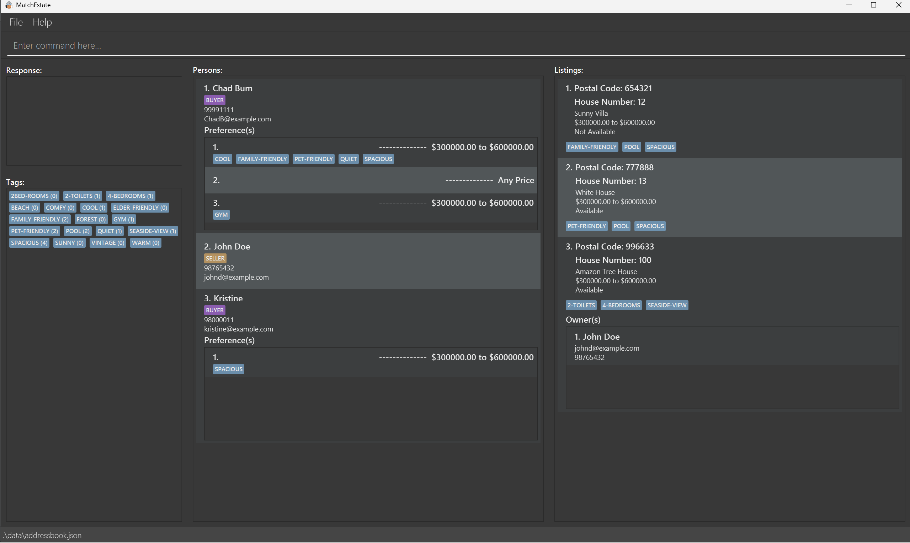

* After
 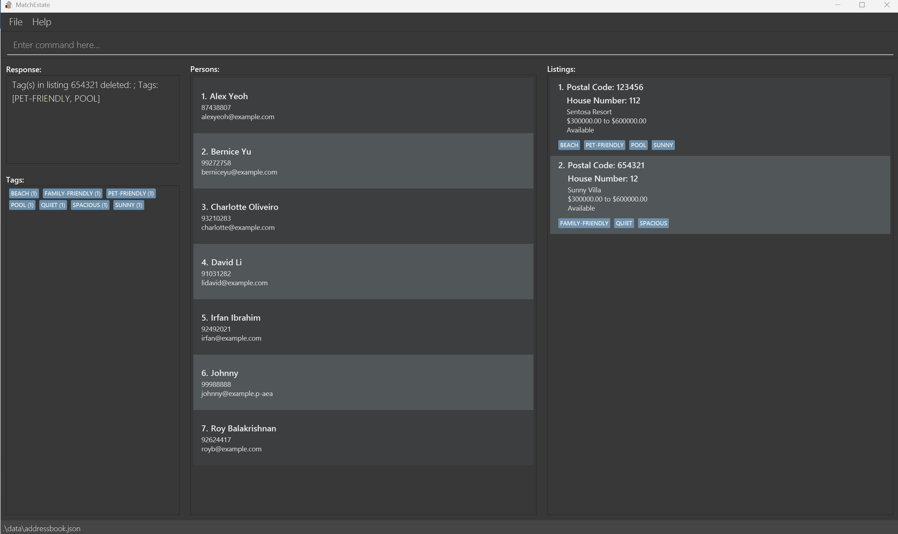

### Matching System

#### Matching person's preference to listings: `matchPreference`
Finds listings matching a person's preference.
The tags and compatible prices of the listing will be highlighted.
Listings that the person owns or that are marked as unavailable will not be shown.
A match is determined by whether a listing has overlapping tags or price range with the specified property preference.
Results are sorted in descending order based on the number of matching tags and price compatibility.

Format: `matchPreference PERSON_INDEX PREFERENCE_INDEX`

Input restriction:
* `PERSON_INDEX` and `PREFERENCE_INDEX` must be a positive integer must be a positive integer within the bounds of the person list and that person's preference list respectively.

> ⚠️ **Note:** Any command will override the results of the filter. However, the commands will act on the currently displayed index.

Example:
* `matchPreference 2 1`

Result for `matchPreference 2 1`:
* Before
 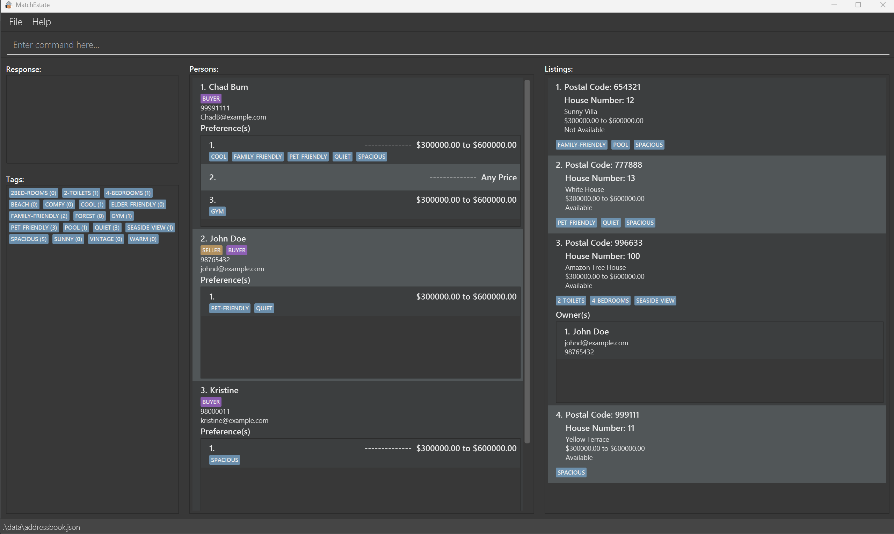

* After
  Finds listings matching a person's preference.
 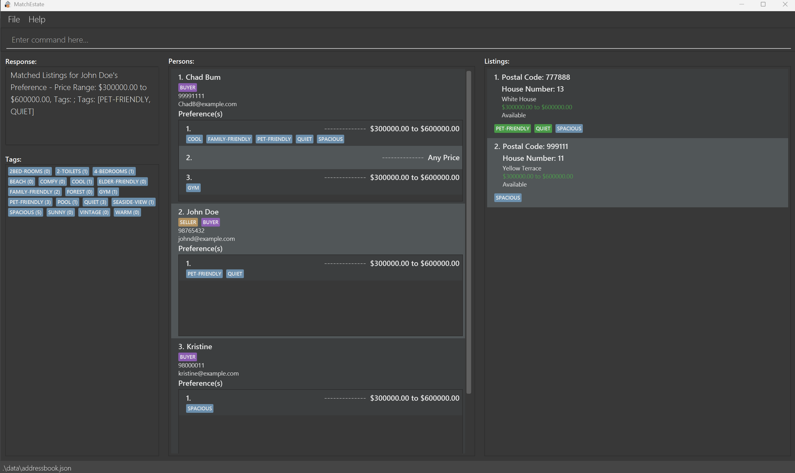

#### Matching listings to persons: `matchListing`
Finds persons whose preferences match a listing.
The tags and compatible prices of the person's preferences will be highlighted.
Persons who owns the listing will not be shown.
A match is determined by whether a person's property preference shares tags or has an overlapping price range with the listing.
Results are sorted in descending order based on the preference with the most matching tags and price compatibility.

Note: matchListing works for unavailable listings such that the users can still look for buyers while the listing is on hold

Format: `matchListing LISTING_INDEX`

Input restriction:
* `LISTING_INDEX` must be a positive integer within the bounds of the listing list.

> ⚠️ **Note:** Any command will override the results of the filter. However, the commands will act on the currently displayed index.

Example:
* `matchListing 1`

Result for `matchListing 1`:
* Before
 

* After
 Find persons whose preferences match a listing.
 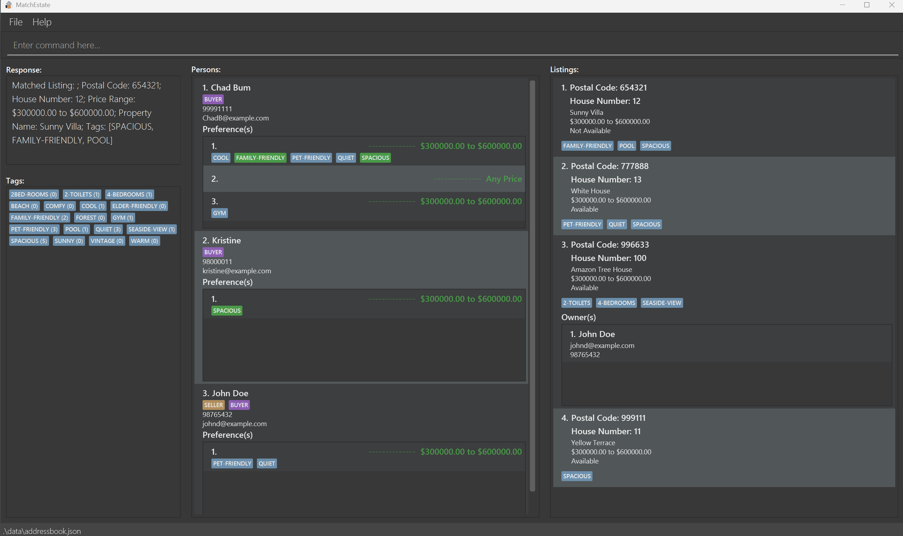

### Listings’ Owner Management

#### Assigning an owner to a listing: `addOwner`
Adds a person as owner to a listing.

Format: `addOwner PERSON_INDEX LISTING_INDEX`

Input restriction:
* `PERSON_INDEX` and `LISTING_INDEX` must be a positive integer within the bounds of the person list and listing’s owner list respectively.

Example:
* `addOwner 2 1`

Result for `addOwner 2 1`:
* Before
 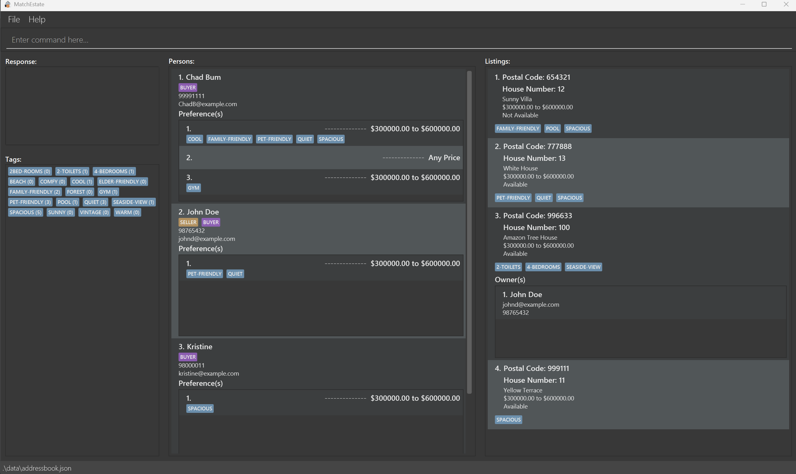

* After
 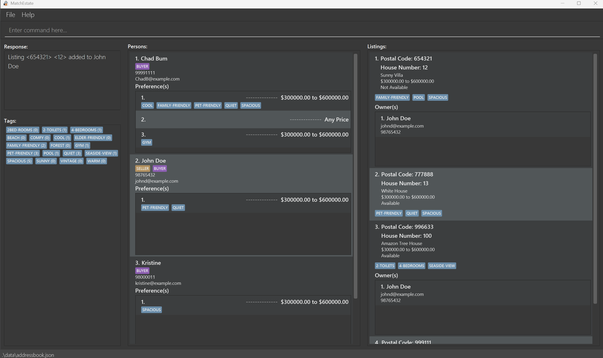

#### Deleting an owner: `deleteOwner`
Removes an owner from a listing.

Format: `deleteOwner LISTING_INDEX OWNER_INDEX`

Input restriction:
* `LISTING_INDEX` and `OWNER_INDEX` must be a positive integer within the bounds of the listing list and the listing’s owner list respectively.

Example:
* `deleteOwner 1 1`

Result for `deleteOwner 1 1`:
* Before
 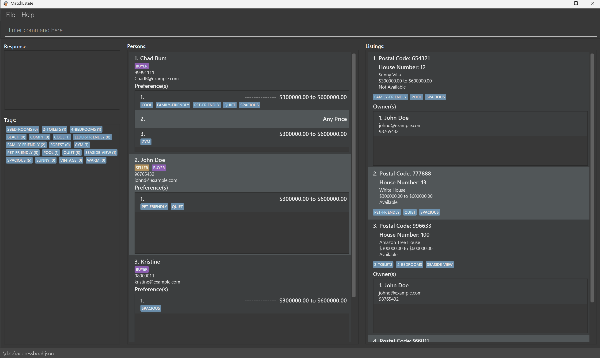

* After
 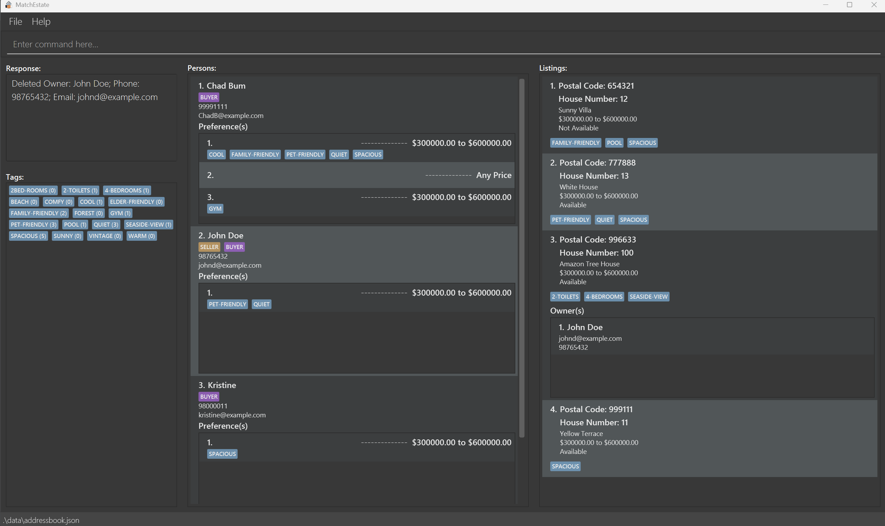

--------------------------------------------------------------------------------------------------------------------

## FAQ

**Q**: How do I transfer my data to another Computer? 
**A**: Install the app in the other computer and overwrite the empty data file it creates with the file that contains the data of your previous MatchEstate home folder.

--------------------------------------------------------------------------------------------------------------------

## Known issues

1. **When using multiple screens**, if you move the application to a secondary screen, and later switch to using only the primary screen, the GUI will open off-screen. The remedy is to delete the `preferences.json` file created by the application before running the application again.

--------------------------------------------------------------------------------------------------------------------
