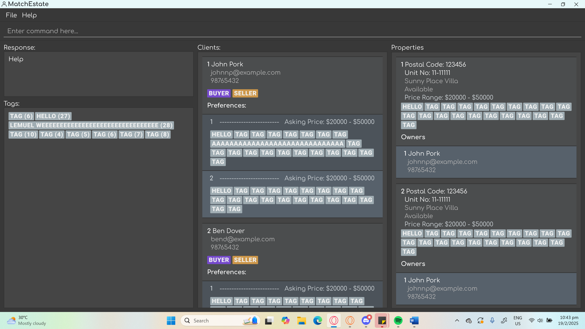
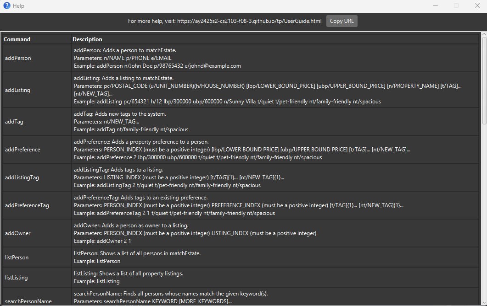

# MatchEstate User Guide

MatchEstate is a **desktop app for real estate agents to efficiently manage and track buyers and sellers. It is optimized for fast keyboard-based input, allowing real estate professionals to handle transactions quickly. If you can type fast, MatchEstate can get your management tasks done faster than traditional GUI apps.

<!-- * Table of Contents -->
<page-nav-print />

--------------------------------------------------------------------------------------------------------------------

## Quick start

1. Ensure you have Java `17` or above installed in your Computer. 
   **Mac users:** Ensure you have the precise JDK version prescribed [here](https://se-education.org/guides/tutorials/javaInstallationMac.html).

1. Download the latest `.jar` file from [here](https://github.com/AY2425S2-CS2103-F08-3/tp/releases/tag/v1.3).

1. Copy the file to the folder you want to use as the _home folder_ for your AddressBook.

1. Open a command terminal, `cd` into the folder you put the jar file in, and use the `java -jar matchestate.jar` command to run the application. 
   A GUI similar to the below should appear in a few seconds. Note how the app contains some sample data. 
   

1. Type the command in the command box and press Enter to execute it. e.g. typing **`help`** and pressing Enter will open the help window. 
   Some example commands you can try:

   * `list` : Lists all contacts.

   * `add n/John Doe p/98765432 e/johnd@example.com a/John street, block 123, #01-01` : Adds a contact named `John Doe` to the Address Book.

   * `delete 3` : Deletes the 3rd contact shown in the current list.

   * `clear` : Deletes all contacts.

   * `exit` : Exits the app.

1. Refer to the [Features](#features) below for details of each command.

--------------------------------------------------------------------------------------------------------------------

## Features

<box type="info" seamless>

**Notes about the command format:** 

* Words in `UPPER_CASE` are the parameters to be supplied by the user. 
  e.g. in `add n/NAME`, `NAME` is a parameter which can be used as `add n/John Doe`.

* Items in square brackets are optional. 
  e.g `n/NAME [t/TAG]` can be used as `n/John Doe t/friend` or as `n/John Doe`.

* Items in brackets are mutually exclusive. 
e.g. `pc/POSTAL_CODE (u/UNIT_NUMBER)(h/HOUSE_NUMBER)` can be used as `pc/654321 u/12-111` or as `pc/654321 h/12` but not both.

* Items with `…`​ after them can be used multiple times including zero times. 
  e.g. `[t/TAG]…​` can be used as ` ` (i.e. 0 times), `t/friend`, `t/friend t/family` etc.

* Parameters can be in any order. 
  e.g. if the command specifies `n/NAME p/PHONE_NUMBER`, `p/PHONE_NUMBER n/NAME` is also acceptable.

* Extraneous parameters for commands that do not take in parameters (such as `help`, `list`, `exit` and `clear`) will be ignored. 
  e.g. if the command specifies `help 123`, it will be interpreted as `help`.

* If you are using a PDF version of this document, be careful when copying and pasting commands that span multiple lines as space characters surrounding line-breaks may be omitted when copied over to the application.
</box>

### Viewing help : `help`

Shows a message explaning how to access the help page.

Format: `help`

### Person Management

#### Adding a person: `addPerson`
Adds a person to the address book.

Format: `addPerson n/NAME p/PHONE e/EMAIL`

Examples:
* `addPerson n/John Doe p/98765432 e/johnd@example.com`

#### Listing all persons: `listPerson`
Shows a list of all persons in the address book.

Format: `listPerson`

#### Editing a person: `editPerson`
Edits an existing person in the address book.

Format: `editPerson INDEX [n/NAME] [p/PHONE] [e/EMAIL]`

* Edits the person at the specified `INDEX`. The index refers to the index number shown in the displayed person list. The index must be a positive integer.
* At least one of the optional fields must be provided.
* Existing values will be updated to the input values.

Examples:
* `editPerson 1 p/91234567 e/johndoe@example.com` Edits the phone number and email address of the 1st person.

#### Searching persons by name: `searchPersonName`
Finds persons whose names match the given keyword(s).

Format: `searchPersonName KEYWORD [MORE_KEYWORDS]`

* The search is case-insensitive.
* Keywords must contain only letters, spaces, hyphens, full stops, or apostrophes.
* Every keyword can only start with a letter.

Examples:
* `searchPersonName Alex Yeoh` returns persons with names matching "Alex Yeoh"

#### Searching persons by preferences: `searchPersonTag`
Finds persons with property preferences containing all specified tags.

Format: `searchPersonTag t/TAG [t/TAG]...`

Example:
* `searchPersonTag t/gym t/pet-friendly` returns all persons who have both `gym` and `pet-friendly` tags.

#### Deleting a person: `deletePerson`
Deletes the specified person from the address book.

Format: `deletePerson INDEX`

* Deletes the person at the specified `INDEX`.
* The index refers to the index number shown in the displayed person list.
* The index must be a positive integer.

Examples:
* `deletePerson 2` deletes the 2nd person in the address book.

### Listing Management

#### Adding a listing: `addListing`
Adds a property listing to the address book.

Format: `addListing pc/POSTAL_CODE (u/UNIT_NUMBER)(h/HOUSE_NUMBER)
 [lbp/LOWER_BOUND_PRICE] [ubp/UPPER_BOUND_PRICE] [n/PROPERTY_NAME] [t/TAG]... [nt/NEW_TAG]...`

Example:
* `addListing pc/654321 h/12 lbp/300000 ubp/600000 n/Sunny Villa t/quiet t/pet-friendly nt/family-friendly nt/spacious`

#### Listing all properties: `listListing`
Shows a list of all property listings.

Format: `listListing`

#### Searching properties by tags: `searchListingTag`
Finds properties with all specified tags.

Format: `searchListingTag t/TAG [t/TAG]...`

Example:
* `searchListingTag t/pet-friendly t/pool`

#### Searching owner properties: `searchOwnerListing`
Finds properties owned by a specific person.

Format: `searchOwnerListing PERSON_INDEX`

Example:
* `searchOwnerListing 1`

#### Marking listing availability:
- `markAvailable`: Marks listing as available
- `markUnavailable`: Marks listing as unavailable

Format: `markAvailable INDEX` or `markUnavailable INDEX`

Listings marked as unavailable will not be matched to any person.

Example:
* `markAvailable 1`
* `markUnavailable 2`

#### Deleting a listing: `deleteListing`
Deletes the specified listing from the address book.

Format: `deleteListing INDEX`

Example:
* `deleteListing 1`

### Tag Management

#### Adding tags: `addTag`
Adds new tags to the system.

Format: `addTag [nt/NEW_TAG]...`

Example:
* `addTag nt/family-friendly nt/spacious`

#### Listing all tags: `listTag`
Shows a list of all available tags.

Format: `listTag`

#### Deleting tags: `deleteTag`
Deletes the specified tags from the system.

Format: `deleteTag [t/TAG]...`

Example:
* `deleteTag t/quiet t/pet-friendly`

### Preference Management

#### Adding a preference: `addPreference`
Adds a property preference to a person.

Format: `addPreference INDEX lbp/LOWER_BOUND_PRICE ubp/UPPER_BOUND_PRICE [t/TAG]... [nt/NEW_TAG]...`

Example:
* `addPreference 2 lbp/300000 ubp/600000 t/quiet t/pet-friendly nt/family-friendly nt/spacious`

#### Adding tags to a preference: `addPreferenceTag`
Adds tags to an existing preference.

Format: `addPreferenceTag PERSON_INDEX PREFERENCE_INDEX [t/TAG]... [nt/NEW_TAG]...`

Example:
* `addPreferenceTag 2 1 t/quiet t/pet-friendly nt/family-friendly nt/spacious`

#### Overwriting preference tags: `overwritePreferenceTag`
Replaces all tags in an existing preference.

Format: `overwritePreferenceTag PERSON_INDEX PREFERENCE_INDEX [t/TAG]... [nt/NEW_TAG]...`

Example:
* `overwritePreferenceTag 3 2 t/2-bedrooms nt/seaside-view`

#### Deleting a preference: `deletePreference`
Deletes a person's property preference.

Format: `deletePreference PERSON_INDEX PREFERENCE_INDEX`

Example:
* `deletePreference 1 2`

#### Deleting preference tags: `deletePreferenceTag`
Deletes tags from a person's preference.

Format: `deletePreferenceTag PERSON_INDEX PREFERENCE_INDEX [t/TAG]...`

Example:
* `deletePreferenceTag 3 1 t/pet-friendly t/pool`

### Property Tag Management

#### Adding tags to listing: `addListingTag`
Adds tags to a property listing.

Format: `addListingTag INDEX [t/TAG]... [nt/NEW_TAG]...`

Example:
* `addListingTag 2 t/quiet t/pet-friendly nt/family-friendly nt/spacious`

#### Overwriting property tags: `overwriteListingTag`
Replaces all tags in a property listing.

Format: `overwriteListingTag LISTING_INDEX [t/TAG]... [nt/NEW_TAG]...`

Example:
* `overwriteListingTag 3 t/4-bedrooms t/2-toilets nt/seaside-view`

#### Deleting property tags: `deleteListingTag`
Deletes tags from a property.

Format: `deleteListingTag PROPERTY_INDEX [t/TAG]...`

Example:
* `deleteListingTag 3 t/pet-friendly t/pool`

### Matching System

#### Matching person's preference to listings: `matchPreference`
Finds listings matching a person's preference.

Format: `matchPreference PERSON_INDEX PREFERENCE_INDEX`

Example:
* `matchPreference 1 2`

Listings that are marked as unavailable or owned by the person will not be shown.

#### Matching listings to persons: `matchListing`
Finds persons whose preferences match a listing.

Format: `matchListing INDEX`

Example:
* `matchListing 1`

### Owner Management

#### Assigning an owner to a listing: `addOwner`
Assigns a person as owner to a listing.

Format: `addOwner PERSON_INDEX LISTING_INDEX`

Example:
* `addOwner 2 1`

#### Deleting an owner: `deleteOwner`
Removes an owner from a listing.

Format: `deleteOwner LISTING_INDEX OWNER_INDEX`

Example:
* `deleteOwner 1 2`

### General Commands

#### Clearing all data: `clear`
Clears all entries from the address book.

Format: `clear`

#### Exiting the program: `exit`
Exits the program.

Format: `exit`

### Saving the data

AddressBook data are saved in the hard disk automatically after any command that changes the data. There is no need to save manually.

### Editing the data file

AddressBook data are saved automatically as a JSON file `[JAR file location]/data/addressbook.json`. Advanced users are welcome to update data directly by editing that data file.

<box type="warning" seamless>

**Caution:**
If your changes to the data file makes its format invalid, AddressBook will discard all data and start with an empty data file at the next run.  Hence, it is recommended to take a backup of the file before editing it. 
Furthermore, certain edits can cause the AddressBook to behave in unexpected ways (e.g., if a value entered is outside the acceptable range). Therefore, edit the data file only if you are confident that you can update it correctly.
</box>

### Archiving data files `[coming in v2.0]`

_Details coming soon ..._

--------------------------------------------------------------------------------------------------------------------

## FAQ

**Q**: How do I transfer my data to another Computer? 
**A**: Install the app in the other computer and overwrite the empty data file it creates with the file that contains the data of your previous AddressBook home folder.

--------------------------------------------------------------------------------------------------------------------

## Known issues

1. **When using multiple screens**, if you move the application to a secondary screen, and later switch to using only the primary screen, the GUI will open off-screen. The remedy is to delete the `preferences.json` file created by the application before running the application again.
2. **If you minimize the Help Window** and then run the `help` command (or use the `Help` menu, or the keyboard shortcut `F1`) again, the original Help Window will remain minimized, and no new Help Window will appear. The remedy is to manually restore the minimized Help Window.

--------------------------------------------------------------------------------------------------------------------

## Command Summary

### Person Management

Action | Format, Examples
---|---
**Add Person** | `addPerson n/NAME p/PHONE e/EMAIL` e.g., `addPerson n/John Doe p/98765432 e/johnd@example.com`
**List Persons** | `listPerson`
**Edit Person** | `editPerson INDEX [n/NAME] [p/PHONE] [e/EMAIL]` e.g., `editPerson 1 p/91234567 e/johndoe@example.com`
**Search Person by Name** | `searchPersonName KEYWORD [MORE_KEYWORDS]` e.g., `searchPersonName Alex Yeoh`
**Search Person by Tags** | `searchPersonTag t/TAG [t/TAG]...` e.g., `searchPersonTag t/gym t/pet-friendly`
**Delete Person** | `deletePerson INDEX` e.g., `deletePerson 2`

### Listing Management

Action | Format, Examples
---|---
**Add Listing** | `addListing pc/POSTAL_CODE [u/UNIT_NUMBER] [h/HOUSE_NUMBER] [lbp/LOWER_BOUND_PRICE] [ubp/UPPER_BOUND_PRICE] [n/PROPERTY_NAME] [t/TAG]... [nt/NEW_TAG]...` e.g., `addListing pc/654321 h/12 lbp/300000 ubp/600000 n/Sunny Villa t/quiet t/pet-friendly`
**List Listings** | `listListing`
**Search Listings by Tags** | `searchListingTag t/TAG [t/TAG]...` e.g., `searchListingTag t/pet-friendly t/pool`
**Search Owner Listings** | `searchOwnerListing PERSON_INDEX` e.g., `searchOwnerListing 1`
**Mark Available** | `markAvailable INDEX` e.g., `markAvailable 1`
**Mark Unavailable** | `markUnavailable INDEX` e.g., `markUnavailable 2`
**Delete Listing** | `deleteListing INDEX` e.g., `deleteListing 1`

### Tag Management

Action | Format, Examples
---|---
**Add Tags** | `addTag [nt/NEW_TAG]...` e.g., `addTag nt/family-friendly nt/spacious`
**List Tags** | `listTag`
**Delete Tags** | `deleteTag [t/TAG]...` e.g., `deleteTag t/quiet t/pet-friendly`

### Preference Management

Action | Format, Examples
---|---
**Add Preference** | `addPreference INDEX lbp/LOWER_BOUND_PRICE ubp/UPPER_BOUND_PRICE [t/TAG]... [nt/NEW_TAG]...` e.g., `addPreference 2 lbp/300000 ubp/600000 t/quiet t/pet-friendly`
**Add Preference Tags** | `addPreferenceTag PERSON_INDEX PREFERENCE_INDEX [t/TAG]... [nt/NEW_TAG]...` e.g., `addPreferenceTag 2 1 t/gym nt/pool`
**Overwrite Preference Tags** | `overwritePreferenceTag PERSON_INDEX PREFERENCE_INDEX [t/TAG]... [nt/NEW_TAG]...` e.g., `overwritePreferenceTag 3 2 t/2-bedrooms nt/seaside-view`
**Delete Preference** | `deletePreference PERSON_INDEX PREFERENCE_INDEX` e.g., `deletePreference 1 2`
**Delete Preference Tags** | `deletePreferenceTag PERSON_INDEX PREFERENCE_INDEX [t/TAG]...` e.g., `deletePreferenceTag 3 1 t/pet-friendly`

### Property Tag Management

Action | Format, Examples
---|---
**Add Listing Tags** | `addListingTag INDEX [t/TAG]... [nt/NEW_TAG]...` e.g., `addListingTag 2 t/quiet t/pet-friendly`
**Overwrite Listing Tags** | `overwriteListingTag LISTING_INDEX [t/TAG]... [nt/NEW_TAG]...` e.g., `overwriteListingTag 3 t/4-bedrooms t/2-toilets`
**Delete Listing Tags** | `deleteListingTag PROPERTY_INDEX [t/TAG]...` e.g., `deleteListingTag 3 t/pet-friendly`

### Matching System

Action | Format, Examples
---|---
**Match Person's Preference to Listings** | `matchPreference PERSON_INDEX PREFERENCE_INDEX` e.g., `matchPreference 1 2`
**Match Listing to Persons** | `matchListing INDEX` e.g., `matchListing 1`

### Owner Management

Action | Format, Examples
---|---
**Add Owner** | `addOwner PERSON_INDEX LISTING_INDEX` e.g., `addOwner 2 1`
**Delete Owner** | `deleteOwner LISTING_INDEX OWNER_INDEX` e.g., `deleteOwner 1 2`

### General Commands

Action | Format, Examples
---|---
**Help** | `help`
**Clear** | `clear`
**Exit** | `exit`
