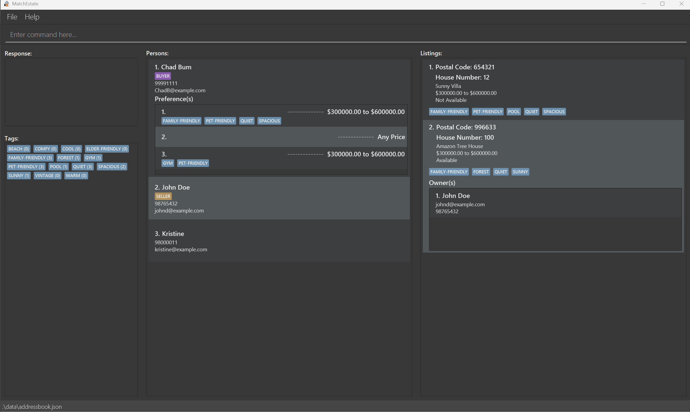

# MatchEstate User Guide

MatchEstate is a **desktop app for real estate agents to efficiently manage and track buyers and sellers. It is optimized for fast keyboard-based input, allowing real estate professionals to handle transactions quickly. If you can type fast, MatchEstate can get your management tasks done faster than traditional GUI apps.

<!-- * Table of Contents -->
<page-nav-print />

--------------------------------------------------------------------------------------------------------------------

## Quick start

1. Ensure you have Java `17` or above installed in your Computer. 
   **Mac users:** Ensure you have the precise JDK version prescribed [here](https://se-education.org/guides/tutorials/javaInstallationMac.html).

1. Download the latest `.jar` file from [here](https://github.com/AY2425S2-CS2103-F08-3/tp/releases/tag/v1.3).

1. Copy the file to the folder you want to use as the _home folder_ for your AddressBook.

1. Open a command terminal, `cd` into the folder you put the jar file in, and use the `java -jar matchestate.jar` command to run the application. 
   A GUI similar to the below should appear in a few seconds. Note how the app contains some sample data. 
   

1. Type the command in the command box and press Enter to execute it. e.g. typing **`help`** and pressing Enter will open the help window. 
   Some example commands you can try:

    * `listPerson` : Lists all persons.

    * `listListing` : Lists all listings.

    * `addPerson n/John Doe p/98765432 e/john@example.com` : Adds a person named `John Doe`.

    * `addTag nt/pool nt/near MRT` : Adds the tags `pool` and `near MRT`.

    * `deletePerson 3` : Deletes the 3rd person shown in the current persons list.

    * `deleteListing 1` : Deletes the 1st listing shown in the current listings list.

    * `clear` : Deletes all contacts.

    * `exit` : Exits the app.

1. Refer to the [Features](#features) below for details of each command.

--------------------------------------------------------------------------------------------------------------------

## Features

<box type="info" seamless>

**Notes about the command format:** 

* Words in `UPPER_CASE` are the parameters to be supplied by the user. 
  e.g. in `add n/NAME`, `NAME` is a parameter which can be used as `add n/John Doe`.

* Items in square brackets are optional. 
  e.g `n/NAME [t/TAG]` can be used as `n/John Doe t/friend` or as `n/John Doe`.

* Items in brackets are mutually exclusive. 
  e.g. `pc/POSTAL_CODE (u/UNIT_NUMBER)(h/HOUSE_NUMBER)` can be used as `pc/654321 u/12-111` or as `pc/654321 h/12` but not both.

* Items with `…`​ after them can be used multiple times but at least one time. 
  e.g. `t/TAG…​` can be used as `t/friend`, `t/friend t/family` etc.

* Items in square brackets with `…`​ after them can be used multiple times including zero times. 
  e.g. `[t/TAG]…​` can be used as ` ` (i.e. 0 times), `t/friend`, `t/friend t/family` etc.

* Items in square brackets with a {num} after them, groups 2 or more prefixes in the command which requires at least 1 prefix from the group to be present. 
  e.g. `[t/TAG]{1}... [nt/NEW_TAG]{1}...` can be used as `nt/friend`, `t/family`, `t/family nt/friend` but not ` `.

* Parameters can be in any order. 
  e.g. if the command specifies `n/NAME p/PHONE_NUMBER`, `p/PHONE_NUMBER n/NAME` is also acceptable.

* Extraneous parameters for commands that do not take in parameters (such as `help`, `list`, `exit` and `clear`) will be ignored. 
  e.g. if the command specifies `help 123`, it will be interpreted as `help`.

* If you are using a PDF version of this document, be careful when copying and pasting commands that span multiple lines as space characters surrounding line-breaks may be omitted when copied over to the application.

</box>

### Command Summary

#### General Commands
| Command   | Description                                             | Usage |
|-----------|---------------------------------------------------------|-------|
**Help** | Displays all command usage on a second window |`help`
**Clear** | Clears all entries from the matchEstate                 |`clear`
**Exit** | Exits the program                                       |`exit`

#### Person Management

| Command   | Description                                                        | Usage |
|-----------|--------------------------------------------------------------------|-------|
**Add Person** | Adds a person to matchEstate.                                     |`addPerson n/NAME p/PHONE e/EMAIL`
**List Persons** | Shows a list of all persons in matchEstate                   |`listPerson`
**Edit Person** | Edits an existing person in matchEstate                      |`editPerson INDEX [n/NAME] [p/PHONE] [e/EMAIL]`
**Search Person by Name** | Finds persons whose names match the given keyword(s)              |`searchPersonName KEYWORD [MORE_KEYWORDS]`
**Search Person by Tags** | Finds persons with property preferences containing all specified tag(s) |`searchPersonTag t/TAG...`
**Delete Person**  | Deletes the specified person from the matchEstate                |`deletePerson INDEX`

### Listing Management

| Command   | Description                                     | Usage |
|-----------|-------------------------------------------------|-------|
**Add Listing** | Adds a listing to matchEstate.             |`addListing pc/POSTAL_CODE (u/UNIT_NUMBER)(h/HOUSE_NUMBER) [lbp/LOWER_BOUND_PRICE] [ubp/UPPER_BOUND_PRICE] [n/PROPERTY_NAME] [t/TAG]... [nt/NEW_TAG]...`
**List Listings** | Shows a list of all property listings          |`listListing`
**Search Listings by Tags** | Finds listings with all specified tags         |`searchListingTag t/TAG...`
**Search Owner’s Listings**  | Finds listings owned by a specific person      |`searchOwnerListing PERSON_INDEX`
**Mark Available**| Marks Listing as available                     |`markAvailable INDEX`
**Mark Unavailable** | Marks listing as unavailable                   |`markUnavailable INDEX`
**Delete Listing** | Deletes the specified listing from matchEstate |`deletePerson INDEX`

### Tag Management

| Command   | Description                                   | Usage |
|-----------|-----------------------------------------------|-------|
**Add Tags** | Adds new tags to the system            |`addTag nt/NEW_TAG...`
**List Tags**  | Shows a list of all tags          |`listTag`
**Delete Tags** | Deletes the specified tags from the system       |`deleteTag t/TAG...`

### Preference Management

| Command   | Description                                   | Usage |
|-----------|-----------------------------------------------|-------|
**Add Preference**  | Adds a property preference to a person          |`addPreference PERSON_INDEX [lbp/LOWER_BOUND_PRICE] [ubp/UPPER_BOUND_PRICE] [t/TAG]... [nt/NEW_TAG]...`
**Add Preference Tags**  | Adds tags to an existing preference          |`addPreferenceTag PERSON_INDEX PREFERENCE_INDEX [t/TAG]{1}... [nt/NEW_TAG]{1}...`
**Overwrite Preference Tags** | Replaces all tags in an existing preference     |`overwritePreferenceTag PERSON_INDEX PREFERENCE_INDEX [t/TAG]{1}... [nt/NEW_TAG]{1}...`
**Delete Preference**  | Deletes a person's property preference        |`deletePreference PERSON_INDEX PREFERENCE_INDEX`
**Delete Preference Tags** | Deletes tags from a person's preference       |`deletePreferenceTag PERSON_INDEX PREFERENCE_INDEX t/TAG...`

### Listing Tag Management
| Command   | Description                     | Usage |
|-----------|---------------------------------|-------|
**Add Listing Tags**  | Adds tags to a listing         |`addListingTag INDEX [t/TAG]{1}... [nt/NEW_TAG]{1}...`
**Overwrite Listing Tags**  | Replaces all tags in a listing |`overwriteListingTag LISTING_INDEX [t/TAG]{1}... [nt/NEW_TAG]{1}...`
**Delete Listing Tags** | Deletes tags from a listing    |`deleteListingTag LISTING_INDEX t/TAG...`

### Matching System
| Command   | Description                     | Usage |
|-----------|---------------------------------|-------|
**Match Person's Preference to Listings**  | Finds listings matching a person's preference        |`matchPreference PERSON_INDEX PREFERENCE_INDEX`
**Match Listing to Persons**   | Finds persons whose preferences match a listing |`matchListing LISTING_INDEX`

### Listing Owner Management
| Command   | Description                          | Usage |
|-----------|--------------------------------------|-------|
**Add Owner**  | Adds a person as owner to a listing |`addOwner PERSON_INDEX LISTING_INDEX`
**Delete Owner**   | Removes an owner from a listing     |`deleteOwner LISTING_INDEX OWNER_INDEX`

### General Commands

#### Viewing help : `help`

Opens a second window displaying all the command usages and explaining how to access the user guide.

Format: `help`

Result:

#### Clearing all data: `clear`
Clears all entries from the address book.

Format: `clear`

#### Exiting the program: `exit`
Exits the program.

Format: `exit`

### Saving the data

MatchEstate data is saved in the hard disk automatically after any command that changes the data. There is no need to save manually.

### Editing the data file

MatchEstate data is saved automatically as a JSON file `[JAR file location]/data/addressbook.json`. Advanced users are welcome to update data directly by editing that data file.

<box type="warning" seamless>

**Caution:**
If your changes to the data file makes its format invalid, MatchEstate will save a copy of the invalid file and start with an empty data file at the next run.  However, it is recommended to make a backup of the file before editing it. 
Furthermore, certain edits can cause the MatchEstate to behave in unexpected ways (e.g., if a value entered is outside the acceptable range). Therefore, edit the data file only if you are confident that you can update it correctly.

</box>

### Person Management

#### Adding a person: `addPerson`
Adds a person to matchEstate .

Format: `addPerson n/NAME p/PHONE e/EMAIL`

Input restriction:
* At least one of the optional fields must be provided.
* `NAME` must only contain 2-50 characters that allow spaces, hyphens, full stops, or apostrophes.
* `PHONE` must be numeric and at least 3-15 digits.
* `EMAIL` must be in a valid format like `name@domain` or `name@domain.com`.

Examples:
* `addPerson n/John Doe p/98765432 e/johnd@example.com`

Result:
* Before
 

* After
 

#### Listing all persons: `listPerson`
Shows a list of all persons in the matchEstate .

Format: `listPerson`

Result:
* Before
 

* After
 

#### Editing a person: `editPerson`
Edits an existing person in the matchEstate.

Format: `editPerson PERSON_INDEX [n/NAME] [p/PHONE] [e/EMAIL]`

Input restriction:
* `PERSON_INDEX` should not be empty.
* `PERSON_INDEX` must be a positive integer.
* At least one of the optional fields must be provided.
* `NAME` must only contain letters, spaces, hyphens, full stops, or apostrophes.
* `PHONE` must be numeric and at least 3 digits.
* `EMAIL` must be in a valid format like `name@example` or `name@example.com`.

Examples:
* `editPerson 2 p/91234567 e/johndoe@example.com` Edits the phone number and email address of the 2nd person.

Result:
* Before
 

* After
 

#### Searching persons by name: `searchPersonName`
Finds persons whose names match the given keyword(s).

Format: `searchPersonName KEYWORD [MORE_KEYWORDS]`

Input restriction:
* The search is case-insensitive.
* `KEYWORD` should not be empty.
* `KEYWORD` must contain only letters, spaces, hyphens, full stops, or apostrophes.
* Every `KEYWORD` can only start with a letter.

Examples:
* `searchPersonName John Doe` returns persons with names matching "John Doe"

Result:
* Before
 

* After
 

#### Searching persons by tags: `searchPersonTag`
Finds persons with property preferences containing all specified tags.

Format: `searchPersonTag t/TAG...`

Input restriction:
* The search is case-insensitive.
* `TAG` should not be empty.
* `TAG` must be between 2 and 30 characters long and can only contain letters, numbers, apostrophes, spaces, periods, hyphens, underscores, plus, and ampersands. The tag cannot be blank and must not already exist (unless for deleting).

Example:
* `searchPersonTag t/gym t/pet-friendly` returns all persons who have both `gym` and `pet-friendly` tags.

Result:
* Before
 

* After
 

#### Deleting a person: `deletePerson`
Deletes the specified person from matchEstate.

Format: `deletePerson PERSON_INDEX`

Input restriction:
* Deletes the person at the specified `INDEX`.
* `PERSON_INDEX` should not be empty.
* `PERSON_INDEX` must be a positive integer.

Examples:
* `deletePerson 2` deletes the 2nd person in matchEstate.

Result:
* Before
 

* After
 

### Listing Management

#### Adding a listing: `addListing`
Adds a property listing to matchEstate.

Format: `addListing pc/POSTAL_CODE (u/UNIT_NUMBER)(h/HOUSE_NUMBER)
[lbp/LOWER_BOUND_PRICE] [ubp/UPPER_BOUND_PRICE] [n/PROPERTY_NAME] [t/TAG]... [nt/NEW_TAG]...`

Input restriction:
* `POSTAL_CODE` must be exactly 6 digits, where each digit must be between 0 and 9.
* `UNIT_NUMBER` must be in the format of <optional B/R prefix><floor_number>-<apartment_number><optional_subunit> where the optional B/R represents basement or roof, the floor_number is 2 digits, the apartment number must be 2 to 5 digits, and subunit must be a capital letter. This subunit letter cannot be I or O. A house number must not be specified with a unit number. Floor number and apartment number cannot start with 0.
* `HOUSE_NUMBER` must be at most 3 characters long, consisting of only letters and numbers. The last character cannot be 'I' or 'O'.
* `LOWER_BOUND_PRICE` and `UPPER_BOUND_PRICE` must be a non-negative number with up to 2 decimal places and at least 1 digit is present. If no value is given, the lower bound price will be unbounded.
* `PROPERTY_NAME` must be between 2 and 100 characters long and can only contain letters, numbers, apostrophes, periods, hyphens, and spaces.
* `TAG` must be between 2 and 30 characters long and can only contain letters, numbers, apostrophes, spaces, periods, hyphens, underscores, plus, and ampersands. The tag cannot be blank and must not already exist (unless for deleting).

Example:
* `addListing pc/654321 h/12 lbp/300000 ubp/600000 n/Sunny Villa t/quiet t/pet-friendly nt/family-friendly nt/spacious`

Result:
* Before
 

* After
 

#### Listing all properties: `listListing`
Shows a list of all property listings.

Format: `listListing`

Result:
* Before
 

* After
 

#### Searching listings by tags: `searchListingTag`
Finds properties with all specified tags.

Format: `searchListingTag t/TAG...`

Input restriction:
* The search is case-insensitive.
* `TAG` should not be empty.
* `TAG` must be between 2 and 30 characters long and can only contain letters, numbers, apostrophes, spaces, periods, hyphens, underscores, plus, and ampersands. The tag cannot be blank and must not already exist (unless for deleting).

Example:
* `searchListingTag t/pet-friendly t/pool`

Result:
* Before
 

* After
 

#### Searching owner’s listings: `searchOwnerListing`
Finds properties owned by a specific person.

Format: `searchOwnerListing PERSON_INDEX`

Input restriction:
* The search is case-insensitive.
* `PERSON_INDEX` should not be empty.
* `PERSON_INDEX` must be a positive integer.

Example:
* `searchOwnerListing 2`

Result:
* Before
 

* After
 

#### Marking listing availability:
- `markAvailable`: Marks listing as available
- `markUnavailable`: Marks listing as unavailable
- Listings marked as unavailable will not be matched to any person.

Format: `markAvailable LISTING_INDEX` or `markUnavailable LISTING_INDEX`

Input restriction:
* `LISTING_INDEX` should not be empty.
* `LISTING_INDEX` must be a positive integer.

Example:
* `markAvailable 1`
* `markUnavailable 2`

Result:
* Before
 

* After
 
 

#### Deleting a listing: `deleteListing`
Deletes the specified listing from matchEstate.

Format: `deleteListing LISTING_INDEX`

Input restriction:
* `LISTING_INDEX` should not be empty.
* `LISTING_INDEX` must be a positive integer.

Example:
* `deleteListing 1`

Result:
* Before
 

* After
 

### Tag Management

#### Adding tags: `addTag`
Adds new tags to the system.

Format: `addTag nt/NEW_TAG...`

Input restriction:
* `TAG` should not be empty.
* `TAG` must be between 2 and 30 characters long and can only contain letters, numbers, apostrophes, spaces, periods, hyphens, underscores, plus, and ampersands. The tag cannot be blank and must not already exist (unless for deleting).

Example:
* `addTag nt/elderly-friendly nt/vintage`

Result:
* Before
 

* After
 

#### Listing all tags: `listTag`
Shows a list of all available tags.

Format: `listTag`

Result:
* Before
 

* After
 

#### Deleting tags: `deleteTag`
Deletes the specified tags from the system.

Format: `deleteTag t/TAG...`

Input restriction:
* `TAG` should not be empty.
* `TAG` must be between 2 and 30 characters long and can only contain letters, numbers, apostrophes, spaces, periods, hyphens, underscores, plus, and ampersands. The tag cannot be blank and must not already exist (unless for deleting).

Example:
* `deleteTag t/quiet t/pet-friendly`

Result:
* Before
 

* After
 

### Preference Management

#### Adding a preference: `addPreference`
Adds a property preference to a person.

Format: `addPreference PERSON_INDEX [lbp/LOWER_BOUND_PRICE] [ubp/UPPER_BOUND_PRICE] [t/TAG]... [nt/NEW_TAG]...`

Input restriction:
* `PERSON_INDEX ` should not be empty.
* `PERSON_INDEX ` must be a positive integer.
* `LOWER_BOUND_PRICE` and `UPPER_BOUND_PRICE` must be a non-negative number with up to 2 decimal places and at least 1 digit is present. If no value is given, the lower bound price will be unbounded.
* `TAG` must be between 2 and 30 characters long and can only contain letters, numbers, apostrophes, spaces, periods, hyphens, underscores, plus, and ampersands. The tag cannot be blank and must not already exist (unless for deleting).

Example:
* `addPreference 2 lbp/300000 ubp/600000 t/quiet t/pet-friendly nt/family-friendly nt/spacious`

Result:
* Before
 

* After
 

#### Adding tags to a preference: `addPreferenceTag`
Adds tags to an existing preference.

Format: `addPreferenceTag PERSON_INDEX PREFERENCE_INDEX [t/TAG]{1}... [nt/NEW_TAG]{1}...`

Input restriction:
* `PERSON_INDEX` and `PREFERENCE_INDEX` should not be empty.
* `PERSON_INDEX` and `PREFERENCE_INDEX` must be a positive integer.
* `TAG` must be between 2 and 30 characters long and can only contain letters, numbers, apostrophes, spaces, periods, hyphens, underscores, plus, and ampersands. The tag cannot be blank and must not already exist (unless for deleting).

Example:
* `addPreferenceTag 1 1 t/quiet t/pet-friendly t/cool`

Result:
* Before
 

* After
 

#### Overwriting preference tags: `overwritePreferenceTag`
Replaces all tags in an existing preference.

Format: `overwritePreferenceTag PERSON_INDEX PREFERENCE_INDEX [t/TAG]{1}... [nt/NEW_TAG]{1}...`

Input restriction:
* `PERSON_INDEX` and `PREFERENCE_INDEX` should not be empty.
* `PERSON_INDEX` and `PREFERENCE_INDEX` must be a positive integer.
* `TAG` must be between 2 and 30 characters long and can only contain letters, numbers, apostrophes, spaces, periods, hyphens, underscores, plus, and ampersands. The tag cannot be blank and must not already exist (unless for deleting).

Example:
* `overwritePreferenceTag 2 1 nt/2-bedrooms nt/seaside-view`

Result:
* Before
 

* After
 

#### Deleting a preference: `deletePreference`
Deletes a person's property preference.

Format: `deletePreference PERSON_INDEX PREFERENCE_INDEX`

Input restriction:
* `PERSON_INDEX` and `PREFERENCE_INDEX` should not be empty.
* `PERSON_INDEX` and `PREFERENCE_INDEX` must be a positive integer.

Example:
* `deletePreference 2 1`

Result:
* Before
 

* After
 

#### Deleting preference tags: `deletePreferenceTag`
Deletes tags from a person's preference.

Format: `deletePreferenceTag PERSON_INDEX PREFERENCE_INDEX t/TAG...`

Input restriction:
* `PERSON_INDEX` and `PREFERENCE_INDEX` should not be empty.
* `PERSON_INDEX` and `PREFERENCE_INDEX` must be a positive integer.
* `TAG` must be between 2 and 30 characters long and can only contain letters, numbers, apostrophes, spaces, periods, hyphens, underscores, plus, and ampersands. The tag cannot be blank and must not already exist (unless for deleting).

Example:
* `deletePreferenceTag 3 1 t/quiet t/cool`

Result:
* Before
 

* After
 

### Listings’ Tag Management

#### Adding tags to listing: `addListingTag`
Adds tags to a property listing.

Format: `addListingTag LISTING_INDEX [t/TAG]{1}... [nt/NEW_TAG]{1}...`

Input restriction:
* `LISTING_INDEX` should not be empty.
* `LISTING_INDEX` must be a positive integer.
* `TAG` must be between 2 and 30 characters long and can only contain letters, numbers, apostrophes, spaces, periods, hyphens, underscores, plus, and ampersands. The tag cannot be blank and must not already exist (unless for deleting).

Example:
* `addListingTag 2 t/quiet t/pet-friendly nt/spacious`

Result:
* Before
 

* After
 

#### Overwriting Listing Tags: `overwriteListingTag`
Replaces all tags in a listing.

Format: `overwriteListingTag LISTING_INDEX [t/TAG]... [nt/NEW_TAG]...`

Input restriction:
* `LISTING_INDEX` should not be empty.
* `LISTING_INDEX` must be a positive integer.
* `TAG` must be between 2 and 30 characters long and can only contain letters, numbers, apostrophes, spaces, periods, hyphens, underscores, plus, and ampersands. The tag cannot be blank and must not already exist (unless for deleting).

Example:
* `overwriteListingTag 2 nt/4-bedrooms nt/2-toilets nt/seaside-view`

Result:
* Before
 

* After
 

#### Delete Listing Tags: `deleteListingTag`
Deletes tags from a listing.

Format: `deleteListingTag LISTING_INDEX t/TAG...`

Input restriction:
* `LISTING_INDEX ` should not be empty.
* `LISTING_INDEX ` must be a positive integer.
* `TAG` must be between 2 and 30 characters long and can only contain letters, numbers, apostrophes, spaces, periods, hyphens, underscores, plus, and ampersands. The tag cannot be blank and must not already exist (unless for deleting).

Example:
* `deleteListingTag 2 t/pet-friendly t/pool`

Result:
* Before
 

* After
 

### Matching System

#### Matching person's preference to listings: `matchPreference`
Finds listings matching a person's preference.

Format: `matchPreference PERSON_INDEX PREFERENCE_INDEX`

Input restriction:
* `PERSON_INDEX` and `PREFERENCE_INDEX` should not be empty.
* `PERSON_INDEX` and `PREFERENCE_INDEX` must be a positive integer.

Example:
* `matchPreference 2 1`

Result:
* Before
 

* After
 

#### Matching listings to persons: `matchListing`
Finds persons whose preferences match a listing.

Format: `matchListing LISTING_INDEX`

Input restriction:
* `LISTING_INDEX` should not be empty.
* `LISTING_INDEX` must be a positive integer.

Example:
* `matchListing 1`

Result:
* Before
 

* After
 

### Listings’ Owner Management

#### Assigning an owner to a listing: `addOwner`
Adds a person as owner to a listing.

Format: `addOwner PERSON_INDEX LISTING_INDEX`

Input restriction:
* `PERSON_INDEX` and `LISTING_INDEX` should not be empty.
* `PERSON_INDEX` and `LISTING_INDEX` must be a positive integer.

Example:
* `addOwner 2 1`

Result:
* Before
 

* After
 

#### Deleting an owner: `deleteOwner`
Removes an owner from a listing.

Format: `deleteOwner LISTING_INDEX OWNER_INDEX`

Input restriction:
* `LISTING_INDEX` and `OWNER_INDEX` should not be empty.
* `LISTING_INDEX` and `OWNER_INDEX` must be a positive integer.

Example:
* `deleteOwner 1 1`

Result:
* Before
 

* After
 

### General Commands

#### Clearing all data: `clear`
Clears all entries from matchEstate.

Format: `clear`

#### Exiting the program: `exit`
Exits the program.

Format: `exit`

### Saving the data

AddressBook data are saved in the hard disk automatically after any command that changes the data. There is no need to save manually.

### Editing the data file

AddressBook data are saved automatically as a JSON file `[JAR file location]/data/addressbook.json`. Advanced users are welcome to update data directly by editing that data file.

<box type="warning" seamless>

**Caution:**
If your changes to the data file makes its format invalid, AddressBook will discard all data and start with an empty data file at the next run.  Hence, it is recommended to take a backup of the file before editing it. 
Furthermore, certain edits can cause the AddressBook to behave in unexpected ways (e.g., if a value entered is outside the acceptable range). Therefore, edit the data file only if you are confident that you can update it correctly.
</box>

### Archiving data files `[coming in v2.0]`

_Details coming soon ..._

--------------------------------------------------------------------------------------------------------------------

## FAQ

**Q**: How do I transfer my data to another Computer? 
**A**: Install the app in the other computer and overwrite the empty data file it creates with the file that contains the data of your previous AddressBook home folder.

--------------------------------------------------------------------------------------------------------------------

## Known issues

1. **When using multiple screens**, if you move the application to a secondary screen, and later switch to using only the primary screen, the GUI will open off-screen. The remedy is to delete the `preferences.json` file created by the application before running the application again.
2. **If you minimize the Help Window** and then run the `help` command (or use the `Help` menu, or the keyboard shortcut `F1`) again, the original Help Window will remain minimized, and no new Help Window will appear. The remedy is to manually restore the minimized Help Window.

--------------------------------------------------------------------------------------------------------------------
